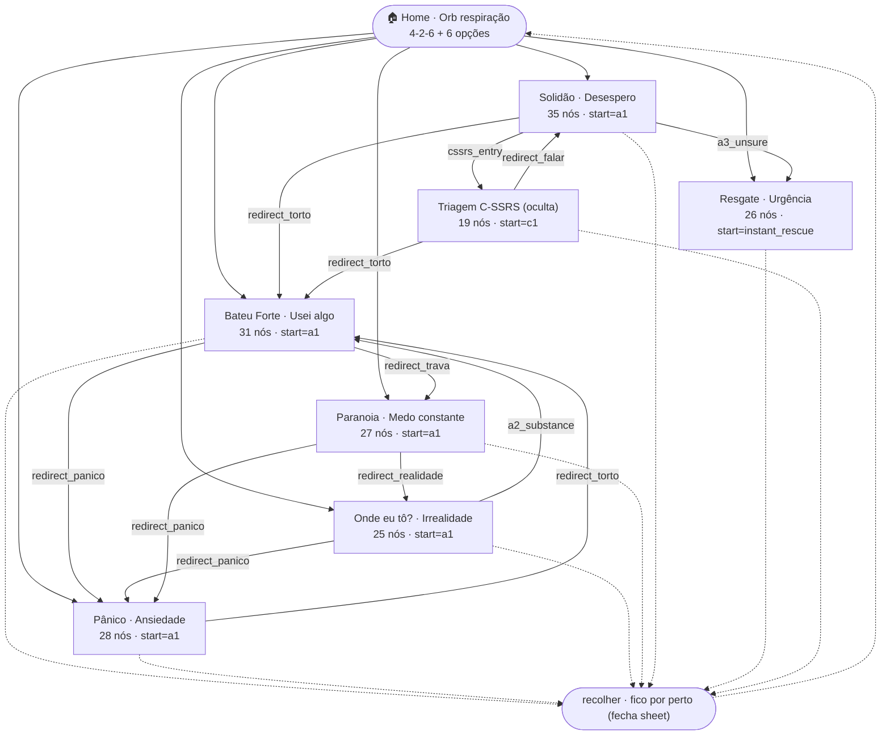

# 000 · Fluxogramas completos — todas as perguntas e respostas

> Gerado automaticamente a partir de `data.embed.js` (fonte de produção) por `tools/mermaid.js` em 2026-09-22.
> Regenerar: `node _audit/000-mapeamento/tools/mermaid.js _audit/000-mapeamento/mermaid` (rodar na raiz do app).
> Validado: os 8 diagramas passam no parser Mermaid v11.

## Legenda

| Forma | Tipo de nó | Comportamento no app |
|---|---|---|
| `{losango}` roxo | `choice` | Pergunta + botões de resposta (rótulo da seta = texto do botão) |
| `(arredondado)` azul | `info` | Texto + botão "continuar devagar" (seta pontilhada) |
| `[[sub-rotina]]` verde | `task` | Checklist; ☐ = tarefa; a seta grossa aparece só depois que TODAS forem marcadas |
| `{{hexágono}}` vermelho | `action` | Botões de ligação/WhatsApp/CAPS (📞) |
| `[/paralelogramo/]` âmbar | `redirect` | Sugere trocar de fluxo ("ir para X" / "ficar aqui") |
| `([estádio])` borda branca | `isDone` | Final: "recolher · fico por perto" + CVV 188 |
| borda **tracejada** / apagada | órfão | Nó existe nos dados, mas nenhum caminho chega nele |
| borda **rosa grossa** | risco | `riskOnEnter` / `locked` (C-SSRS) |
| `⚠ HIGH` no rótulo | escolha com `riskLevel` | Aumenta o risco da sessão (nunca diminui) |
| `⚡ preciso de algo agora` | fast-lane | Botão extra só no nó `a1` de 5 fluxos |

## 0. Visão geral (Home → fluxos → redirecionamentos)

## 1. Bateu Forte · Usei algo (`torto`)

```mermaid
flowchart TD
  START(["▶ Bateu Forte · Usei algo"]) --> torto_a1
  torto_a1{"<b>a1</b><br/>Que bom que você abriu isso. Tô aqui com você. O que tá acontecendo m…"}
  class torto_a1 choice
  torto_a2{"<b>a2</b><br/>Entendi. O que você está sentindo mais agora?"}
  class torto_a2 choice
  torto_a2_unclear("<b>a2_unclear</b><br/>Não saber é tudo bem. Às vezes a gente só sente que precisa de apoio.…")
  class torto_a2_unclear info
  torto_a3_stim[["<b>a3_stim</b><br/>Estimulantes aceleram o coração e a mente.. isso assusta, mas o corpo…<br/>☐ Água gelada no rosto, nuca ou pun…"]]
  class torto_a3_stim task,orphan
  torto_a3_psych("<b>a3_psych</b><br/>Psicodélicos e dissociativos alteram como você percebe a realidade.. …")
  class torto_a3_psych info
  torto_redirect_panico[/"<b>redirect_panico</b><br/>O que você descreveu parece mais próximo de uma crise de ansiedade.. …<br/>↪ Quer ir para o suporte de Pânico?"/]
  class torto_redirect_panico redirect
  torto_redirect_trava[/"<b>redirect_trava</b><br/>Essa sensação de ser observado ou de estar travado tem um protocolo q…<br/>↪ Quer ir para o suporte de Travei?"/]
  class torto_redirect_trava redirect
  torto_m1("<b>m1</b><br/>Você abriu este espaço.. isso já é um passo. Não precisa resolver nad…")
  class torto_m1 info
  torto_m2[["<b>m2</b><br/>Antes de mais nada, vamos colocar o seu corpo num lugar mais seguro:<br/>☐ Senta ou deita em algum lugar est…<br/>☐ Vira o celular com a tela para ba…"]]
  class torto_m2 task
  torto_m3[["<b>m3</b><br/>Se ainda não jogou água fria.. faz agora. Se já fez, repete mais uma …<br/>☐ Água gelada no rosto ou nas mãos"]]
  class torto_m3 task
  torto_m4[["<b>m4</b><br/>Agora o ambiente:<br/>☐ Diminui o volume do que estiver t…<br/>☐ Encontra um cantinho mais quieto …"]]
  class torto_m4 task
  torto_m5{"<b>m5</b><br/>Como você está em relação a antes de abrir isso?"}
  class torto_m5 choice
  torto_m6_better("<b>m6_better</b><br/>O pico pode estar mudando.. ou não ainda. Os dois são normais. Contin…")
  class torto_m6_better info
  torto_m6_same("<b>m6_same</b><br/>Normal. O pico ainda está rolando. O corpo precisa de tempo para proc…")
  class torto_m6_same info
  torto_m6_worse{"<b>m6_worse</b><br/>Obrigado por me contar. Se está piorando, você pode precisar de ajuda…"}
  class torto_m6_worse choice
  torto_action_samu{{"<b>action_samu</b><br/>Liga agora.. continuo aqui com você:<br/>📞 SAMU — 192<br/>📞 Bombeiros — 193"}}
  class torto_action_samu action
  torto_m7("<b>m7</b><br/>Vamos respirar juntos agora: Inspira lenta e profundamente pelo nariz…")
  class torto_m7 info
  torto_m8[["<b>m8</b><br/>Trazendo você de volta para o presente:<br/>☐ Nomeia 5 coisas que você vê<br/>☐ Toca em algo próximo"]]
  class torto_m8 task
  torto_m9[["<b>m9</b><br/>Duas coisas práticas agora:<br/>☐ Afasta qualquer substância de per…<br/>☐ Hidratar (água ou suco)"]]
  class torto_m9 task
  torto_m10("<b>m10</b><br/>O que você sente agora é intenso.. não é permanente, mesmo parecendo.…")
  class torto_m10 info
  torto_m11{"<b>m11</b><br/>Tem alguém de confiança que você pode contactar agora?"}
  class torto_m11 choice
  torto_m11_yes("<b>m11_yes</b><br/>Liga ou manda mensagem. Você não precisa explicar tudo.. só diz: 'Tô …")
  class torto_m11_yes info
  torto_m11_no{{"<b>m11_no</b><br/>Tudo bem. Tem um serviço gratuito, anônimo e humano disponível agora:<br/>📞 CVV — 188 (gratuito, 24h)"}}
  class torto_m11_no action
  torto_m12("<b>m12</b><br/>O efeito vai passando gradualmente.. às vezes sobe, às vezes baixa, m…")
  class torto_m12 info
  torto_m13[["<b>m13</b><br/>Se quiser, tem uma coisa que ajuda o tempo a passar:<br/>☐ Coloca uma música instrumental ca…"]]
  class torto_m13 task
  torto_m14("<b>m14</b><br/>Você ficou aqui um tempo. Respirou. Fez o que deu. Isso não apaga a d…")
  class torto_m14 info
  torto_m15(["<b>m15</b><br/>Se ainda estiver pesado, não precisa estar bem agora. Este espaço fic…"])
  class torto_m15 info,endn
  torto_fast_stim[["<b>fast_stim</b><br/>Toque em cada tarefa conforme você for fazendo:<br/>☐ Choque térmico no rosto<br/>☐ Reduzir estímulos<br/>☐ Guardar tudo"]]
  class torto_fast_stim task
  torto_harm_alcohol[["<b>harm_alcohol</b><br/>Álcool desidrata e acelera o coração. Faça uma de cada vez:<br/>☐ 1 copo de água (250 mL) por dose<br/>☐ Comer proteína, fibra ou gordura …<br/>☐ Não dirigir nem operar máquinas<br/>☐ Pausa reflexiva (10 segundos) ⟨crt_pause⟩"]]
  class torto_harm_alcohol task
  torto_harm_injection[["<b>harm_injection</b><br/>Segurança física primeiro.. uma de cada vez:<br/>☐ Seringa estéril, uso único<br/>☐ Kit de teste se tiver<br/>☐ Não misturar depressores<br/>☐ Respiração lenta se ansioso ⟨breath_guide⟩"]]
  class torto_harm_injection task
  torto_fast_psych[["<b>fast_psych</b><br/>Psicodélicos alteram percepção.. não a realidade. Uma coisa de cada v…<br/>☐ Trocar som / ruído marrom<br/>☐ Mudar cômodo ou luz<br/>☐ Doce na boca<br/>☐ Não lutar contra o estranho"]]
  class torto_fast_psych task
  torto_a1 -->|"Usei algo e tá muito pesado"| torto_a2
  torto_a1 -->|"Bebi álcool e tô mal"| torto_harm_alcohol
  torto_a1 -->|"Não usei nada, mas tô muito mal"| torto_redirect_panico
  torto_a1 -->|"Não sei bem o que sinto"| torto_a2_unclear
  torto_a2 -->|"Coração acelerado, agitação, calor"| torto_fast_stim
  torto_a2 -->|"Tudo parece distante ou irreal"| torto_a3_psych
  torto_a2 -->|"Pânico puro, sem controle"| torto_redirect_panico
  torto_a2 -->|"Sensação de estar sendo observado"| torto_redirect_trava
  torto_a2 -->|"Usei por injeção / seringa"| torto_harm_injection
  torto_a2_unclear -.->|continuar| torto_m1
  torto_a3_stim ==>|"joguei água fria"| torto_fast_stim
  torto_a3_psych -.->|continuar| torto_fast_psych
  torto_redirect_panico -->|ficar aqui| torto_m1
  torto_redirect_panico -->|"ir para panico"| FLOW_panico
  torto_redirect_trava -->|ficar aqui| torto_m1
  torto_redirect_trava -->|"ir para trava"| FLOW_trava
  torto_m1 -.->|continuar| torto_m2
  torto_m2 ==>|"feito isso."| torto_m3
  torto_m3 ==>|"água fria de novo"| torto_m4
  torto_m4 ==>|"feito."| torto_m5
  torto_m5 -->|"Um pouco melhor"| torto_m6_better
  torto_m5 -->|"Mais ou menos igual"| torto_m6_same
  torto_m5 -->|"Piorei, tô muito mal"| torto_m6_worse
  torto_m6_better -.->|continuar| torto_m7
  torto_m6_same -.->|continuar| torto_m7
  torto_m6_worse -->|"Ligo para o SAMU (192)"| torto_action_samu
  torto_m6_worse -->|"Continue tentando aqui comigo"| torto_m7
  torto_action_samu -.->|continuar| torto_m7
  torto_m7 -.->|continuar| torto_m8
  torto_m8 ==>|"ancorado aqui."| torto_m9
  torto_m9 ==>|"feito."| torto_m10
  torto_m10 -.->|continuar| torto_m11
  torto_m11 -->|"Sim, tem alguém"| torto_m11_yes
  torto_m11 -->|"Não tem ninguém disponível agora"| torto_m11_no
  torto_m11 -->|"Prefiro ficar quieto por agora"| torto_m12
  torto_m11_yes -.->|continuar| torto_m12
  torto_m11_no -.->|continuar| torto_m12
  torto_m12 -.->|continuar| torto_m13
  torto_m13 ==>|"música ligada."| torto_m14
  torto_m14 -.->|continuar| torto_m15
  torto_m15 -.->|continuar| EXIT
  torto_fast_stim ==>|"continuo aqui"| torto_m1
  torto_harm_alcohol ==>|"feito"| torto_m1
  torto_harm_injection ==>|"continuo aqui"| torto_fast_stim
  torto_fast_psych ==>|"continuo aqui"| torto_m1
  torto_a1 -. "⚡ preciso de algo agora" .-> torto_fast_stim
  FLOW_panico(["→ fluxo panico"])
  class FLOW_panico ext
  FLOW_trava(["→ fluxo trava"])
  class FLOW_trava ext
  EXIT(["fecha · volta à Home"])
  class EXIT ext
  classDef choice fill:#1b1030,stroke:#a855f7,color:#eee
  classDef info fill:#0f1a24,stroke:#38bdf8,color:#ddd
  classDef task fill:#0f2419,stroke:#34d399,color:#ddd
  classDef action fill:#2a0f12,stroke:#ef4444,color:#fff,stroke-width:2px
  classDef redirect fill:#241a0a,stroke:#f59e0b,color:#eee
  classDef endn fill:#111,stroke:#fff,color:#fff,stroke-width:3px
  classDef orphan stroke-dasharray:6 4,opacity:0.55
  classDef risk stroke:#ff0055,stroke-width:4px
  classDef ext fill:#333,stroke:#999,color:#fff
```

## 2. Pânico · Ansiedade (`panico`)

```mermaid
flowchart TD
  START(["▶ Pânico · Ansiedade"]) --> panico_a1
  panico_a1{"<b>a1</b><br/>Tô aqui com você. Me conta.. o que está acontecendo mais agora?"}
  class panico_a1 choice
  panico_a2{"<b>a2</b><br/>O que você está sentindo mais no corpo agora?"}
  class panico_a2 choice
  panico_a2_unclear("<b>a2_unclear</b><br/>Não saber é tudo bem. Você está aqui.. e isso já é muito. Vamos junto…")
  class panico_a2_unclear info
  panico_a3_moderate[["<b>a3_moderate</b><br/>Isso é pânico.. o cérebro grita perigo quando não há. Primeiro, água …<br/>☐ Água gelada no rosto, nuca ou pun…"]]
  class panico_a3_moderate task
  panico_a3_severe[["<b>a3_severe</b><br/>Isso é muito desconfortável.. mas seu corpo não está morrendo. Está e…<br/>☐ Água gelada no rosto, nuca ou pun…"]]
  class panico_a3_severe task
  panico_redirect_torto[/"<b>redirect_torto</b><br/>Se você usou algo, temos um suporte mais específico para isso que pod…<br/>↪ Quer ir para o suporte de Bateu Forte?"/]
  class panico_redirect_torto redirect
  panico_m1("<b>m1</b><br/>Você não está em perigo real. O pânico é alarme falso.. coração acele…")
  class panico_m1 info
  panico_m3[["<b>m3</b><br/>Agora o Humming.. vibração que acalma o nervo vago:<br/>☐ Fecha a boca e faz um 'hmmmmm' co…"]]
  class panico_m3 task
  panico_m4[["<b>m4</b><br/>Uma âncora física agora:<br/>☐ Água gelada nas mãos, nuca ou ros…"]]
  class panico_m4 task
  panico_m5{"<b>m5</b><br/>Como você está em relação a alguns minutos atrás?"}
  class panico_m5 choice
  panico_m6_better("<b>m6_better</b><br/>O pico pode estar baixando um pouco.. ou não ainda. Os dois são norma…")
  class panico_m6_better info
  panico_m6_same("<b>m6_same</b><br/>O pânico tem pico.. e depois baixa. Mesmo parecendo eterno, não é ete…")
  class panico_m6_same info
  panico_m7[["<b>m7</b><br/>Agora o 5-4-3-2-1.. trazendo você para o presente:<br/>☐ 5 coisas que você consegue VER<br/>☐ 4 coisas que você consegue TOCAR<br/>☐ 3 sons que você consegue OUVIR<br/>☐ Respiração alternada (5 min)"]]
  class panico_m7 task
  panico_m8[["<b>m8</b><br/>Agora o corpo:<br/>☐ Postura de segurança"]]
  class panico_m8 task
  panico_m9("<b>m9</b><br/>Continuo aqui com você. O pânico não dura para sempre. Tem início, me…")
  class panico_m9 info
  panico_m10("<b>m10</b><br/>O pânico acontece quando o alarme do cérebro dispara sem perigo real.…")
  class panico_m10 info
  panico_m11{"<b>m11</b><br/>Você gostaria de chamar alguém para ficar com você?"}
  class panico_m11 choice
  panico_m11_yes("<b>m11_yes</b><br/>Manda mensagem para alguém de confiança: 'Tô com uma crise de ansieda…")
  class panico_m11_yes info
  panico_m12("<b>m12</b><br/>Respirar devagar ainda é a ferramenta mais poderosa que você tem agor…")
  class panico_m12 info
  panico_m13{{"<b>m13</b><br/>Se quiser uma voz humana agora:<br/>📞 CVV — 188 (gratuito, 24h)"}}
  class panico_m13 action
  panico_m14("<b>m14</b><br/>Você ficou aqui. Não saiu no pior momento. Isso não resolve tudo.. ma…")
  class panico_m14 info
  panico_m15(["<b>m15</b><br/>Se ainda estiver mal, tudo bem não estar bem. CVV 188.. voz humana, 2…"])
  class panico_m15 info,endn
  panico_fast_panic[["<b>fast_panic</b><br/>O pânico engana o cérebro dizendo que há perigo imediato. Vamos envia…<br/>☐ Segurar algo muito frio<br/>☐ Respiração 4-6 (10 vezes) ⟨breath_guide⟩<br/>☐ Suspiro Duplo (faça 3x)<br/>☐ Vibração suave (humming)"]]
  class panico_fast_panic task
  panico_breath_46[["<b>breath_46</b><br/>Respiração diafragmática.. a mais eficaz agora:<br/>☐ 4-6-10.. inspira, segura, expira ⟨breath_guide⟩"]]
  class panico_breath_46 task
  panico_mindfulness_5[["<b>mindfulness_5</b><br/>Mindfulness breve (5 min).. observar sem julgar:<br/>☐ Observar o ar 5 minutos"]]
  class panico_mindfulness_5 task
  panico_m2[["<b>m2</b><br/>Primeiro.. o Suspiro Duplo:<br/>☐ Suspiro Duplo.. 3 vezes"]]
  class panico_m2 task
  panico_draw_distract[["<b>draw_distract</b><br/>Atividade leve.. ocupar as mãos:<br/>☐ Rabiscar ou escrever 5 minutos"]]
  class panico_draw_distract task
  panico_box_breath_high[["<b>box_breath_high</b><br/>Se ainda intenso.. box breathing (4-4-4-4):<br/>☐ Box 4×4.. 4 ciclos ⟨breath_guide⟩"]]
  class panico_box_breath_high task
  panico_a1 -->|"Coração acelerado, falta de ar"| panico_a3_moderate
  panico_a1 -->|"Usei algo que pode ter causado isso"| panico_redirect_torto
  panico_a1 -->|"Sensação de perigo sem razão clara"| panico_a2
  panico_a1 -->|"Não sei, só sei que tô muito mal"| panico_a2_unclear
  panico_a2 -->|"Formigamento, tontura, mãos suando"| panico_a3_severe
  panico_a2 -->|"Coração acelerado, agonia, aperto no …"| panico_a3_moderate
  panico_a2 -->|"Pensamentos em espiral, não consigo p…"| panico_a3_moderate
  panico_a2_unclear -.->|continuar| panico_m1
  panico_a3_moderate ==>|"joguei água fria"| panico_m1
  panico_a3_severe ==>|"joguei água fria"| panico_m1
  panico_redirect_torto -->|ficar aqui| panico_m1
  panico_redirect_torto -->|"ir para torto"| FLOW_torto
  panico_m1 -.->|continuar| panico_breath_46
  panico_m3 ==>|"senti a vibração."| panico_draw_distract
  panico_m4 ==>|"feito isso."| panico_box_breath_high
  panico_m5 -->|"Um pouco melhor"| panico_m6_better
  panico_m5 -->|"Igual ou ainda muito mal"| panico_m6_same
  panico_m6_better -.->|continuar| panico_m7
  panico_m6_same -.->|continuar| panico_m7
  panico_m7 ==>|"voltei para o presente."| panico_m8
  panico_m8 ==>|"estou apoiado."| panico_m9
  panico_m9 -.->|continuar| panico_m10
  panico_m10 -.->|continuar| panico_m11
  panico_m11 -->|"Sim, vou chamar alguém"| panico_m11_yes
  panico_m11 -->|"Prefiro ficar quieto por agora"| panico_m12
  panico_m11_yes -.->|continuar| panico_m12
  panico_m12 -.->|continuar| panico_m13
  panico_m13 -.->|continuar| panico_m14
  panico_m14 -.->|continuar| panico_m15
  panico_m15 -.->|continuar| EXIT
  panico_fast_panic ==>|"continuo aqui"| panico_m1
  panico_breath_46 ==>|"respirei"| panico_m2
  panico_mindfulness_5 ==>|"observei"| panico_m3
  panico_m2 ==>|"feito as 3 vezes."| panico_mindfulness_5
  panico_draw_distract ==>|"rabischei"| panico_m4
  panico_box_breath_high ==>|"box feito"| panico_m5
  panico_a1 -. "⚡ preciso de algo agora" .-> panico_fast_panic
  FLOW_torto(["→ fluxo torto"])
  class FLOW_torto ext
  EXIT(["fecha · volta à Home"])
  class EXIT ext
  classDef choice fill:#1b1030,stroke:#a855f7,color:#eee
  classDef info fill:#0f1a24,stroke:#38bdf8,color:#ddd
  classDef task fill:#0f2419,stroke:#34d399,color:#ddd
  classDef action fill:#2a0f12,stroke:#ef4444,color:#fff,stroke-width:2px
  classDef redirect fill:#241a0a,stroke:#f59e0b,color:#eee
  classDef endn fill:#111,stroke:#fff,color:#fff,stroke-width:3px
  classDef orphan stroke-dasharray:6 4,opacity:0.55
  classDef risk stroke:#ff0055,stroke-width:4px
  classDef ext fill:#333,stroke:#999,color:#fff
```

## 3. Onde eu tô? · Irrealidade (`realidade`)

```mermaid
flowchart TD
  START(["▶ Onde eu tô? · Irrealidade"]) --> realidade_a1
  realidade_a1{"<b>a1</b><br/>Tô aqui com você. Essa sensação de irrealidade pode ter causas difere…"}
  class realidade_a1 choice
  realidade_a2("<b>a2</b><br/>O que você está descrevendo se chama despersonalização ou desrealizaç…")
  class realidade_a2 info
  realidade_a2_substance[/"<b>a2_substance</b><br/>Se você usou algo, temos um suporte mais específico que pode ajudar m…<br/>↪ Quer ir para o suporte de Bateu Forte?"/]
  class realidade_a2_substance redirect
  realidade_a3_anchor("<b>a3_anchor</b><br/>Tudo bem não conseguir explicar. O que eu sei é que você está aqui. O…")
  class realidade_a3_anchor info
  realidade_redirect_panico[/"<b>redirect_panico</b><br/>Se junto à irrealidade tem muito medo e coração acelerado, o suporte …<br/>↪ Quer ir para o suporte de Pânico?"/]
  class realidade_redirect_panico redirect,orphan
  realidade_m1("<b>m1</b><br/>Você é real. Esse momento é real. Vamos trazer você de volta para o c…")
  class realidade_m1 info
  realidade_m2[["<b>m2</b><br/>A âncora mais poderosa é o toque físico:<br/>☐ Toca no tecido da sua roupa<br/>☐ Coloca a palma da mão no chão ou …"]]
  class realidade_m2 task
  realidade_m3[["<b>m3</b><br/>Agora nomeando o que existe:<br/>☐ Diz em voz alta o nome de 3 objet…"]]
  class realidade_m3 task
  realidade_m4[["<b>m4</b><br/>Temperatura como âncora:<br/>☐ Água fria nas mãos ou no rosto"]]
  class realidade_m4 task
  realidade_m5{"<b>m5</b><br/>A sensação de estranhamento está um pouco menor?"}
  class realidade_m5 choice
  realidade_m6("<b>m6</b><br/>Isso. Você está trazendo o seu sistema nervoso de volta. Continue com…")
  class realidade_m6 info
  realidade_m6_hard("<b>m6_hard</b><br/>Tudo bem. Às vezes o estado demora mais para passar. Isso não é perma…")
  class realidade_m6_hard info
  realidade_m7[["<b>m7</b><br/>Os 5 sentidos.. um de cada vez:<br/>☐ Diz uma coisa que você VÊ agora<br/>☐ Diz um som que você OUVE<br/>☐ Cheira algo que esteja próximo"]]
  class realidade_m7 task
  realidade_m8("<b>m8</b><br/>Você está aqui comigo. A despersonalização é desconfortável mas inofe…")
  class realidade_m8 info
  realidade_m9[["<b>m9</b><br/>Movimento leve.. um dos melhores redefinidores de presença:<br/>☐ Aperta e solte os punhos lentamen…<br/>☐ Mexe os dedos dos pés dentro do s…"]]
  class realidade_m9 task
  realidade_m10("<b>m10</b><br/>Você está aqui. No presente. Nesse espaço. O passado não está te puxa…")
  class realidade_m10 info
  realidade_m11{"<b>m11</b><br/>Tem alguém que pode ficar com você por um tempo agora?"}
  class realidade_m11 choice
  realidade_m11_yes("<b>m11_yes</b><br/>Chama. Uma presença humana ao lado.. mesmo em silêncio.. ajuda muito …")
  class realidade_m11_yes info
  realidade_m11_no{{"<b>m11_no</b><br/>Tudo bem. O CVV tem vozes humanas disponíveis agora:<br/>📞 CVV — 188 (gratuito, 24h)"}}
  class realidade_m11_no action
  realidade_m12("<b>m12</b><br/>Uma coisa que pode ajudar nas próximas horas: evita telas, ruído exce…")
  class realidade_m12 info
  realidade_m13[["<b>m13</b><br/>Um gesto final de cuidado:<br/>☐ Coloca algo suave ao redor de você"]]
  class realidade_m13 task
  realidade_m14("<b>m14</b><br/>Você ficou aqui um tempo. Mesmo sentindo que tudo estava estranho, vo…")
  class realidade_m14 info
  realidade_m15(["<b>m15</b><br/>Você está aqui. Agora. Se ainda estiver estranho, continue devagar. L…"])
  class realidade_m15 info,endn
  realidade_fast_realidade[["<b>fast_realidade</b><br/>As coisas parecem estranhas? Isso é uma defesa natural da mente ao es…<br/>☐ Tocar na textura<br/>☐ Nomear 3 coisas<br/>☐ Água fria nas mãos ou rosto"]]
  class realidade_fast_realidade task
  realidade_mindfulness_real[["<b>mindfulness_real</b><br/>Mindfulness breve (5 min):<br/>☐ Observar respiração 5 min"]]
  class realidade_mindfulness_real task
  realidade_a1 -->|"As coisas parecem distantes ou como n…"| realidade_a2
  realidade_a1 -->|"Eu mesmo pareço irreal ou distante de…"| realidade_a2
  realidade_a1 -->|"Usei algo que pode ter causado isso"| realidade_a2_substance
  realidade_a1 -->|"Não sei explicar, está tudo estranho"| realidade_a3_anchor
  realidade_a2 -.->|continuar| realidade_m1
  realidade_a2_substance -->|ficar aqui| realidade_m1
  realidade_a2_substance -->|"ir para torto"| FLOW_torto
  realidade_a3_anchor -.->|continuar| realidade_m1
  realidade_redirect_panico -->|ficar aqui| realidade_m1
  realidade_redirect_panico -->|"ir para panico"| FLOW_panico
  realidade_m1 -.->|continuar| realidade_m2
  realidade_m2 ==>|"senti o real."| realidade_m3
  realidade_m3 ==>|"nomeei as 3 coisas."| realidade_m4
  realidade_m4 ==>|"senti a temperatura."| realidade_mindfulness_real
  realidade_m5 -->|"Sim, um pouco"| realidade_m6
  realidade_m5 -->|"Ainda está muito forte"| realidade_m6_hard
  realidade_m6 -.->|continuar| realidade_m7
  realidade_m6_hard -.->|continuar| realidade_m7
  realidade_m7 ==>|"usei meus sentidos."| realidade_m8
  realidade_m8 -.->|continuar| realidade_m9
  realidade_m9 ==>|"me movi."| realidade_m10
  realidade_m10 -.->|continuar| realidade_m11
  realidade_m11 -->|"Sim, posso chamar alguém"| realidade_m11_yes
  realidade_m11 -->|"Não agora"| realidade_m11_no
  realidade_m11_yes -.->|continuar| realidade_m12
  realidade_m11_no -.->|continuar| realidade_m12
  realidade_m12 -.->|continuar| realidade_m13
  realidade_m13 ==>|"estou mais aquecido."| realidade_m14
  realidade_m14 -.->|continuar| realidade_m15
  realidade_m15 -.->|continuar| EXIT
  realidade_fast_realidade ==>|"ancorado aqui"| realidade_m1
  realidade_mindfulness_real ==>|"observei"| realidade_m5
  realidade_a1 -. "⚡ preciso de algo agora" .-> realidade_fast_realidade
  FLOW_torto(["→ fluxo torto"])
  class FLOW_torto ext
  FLOW_panico(["→ fluxo panico"])
  class FLOW_panico ext
  EXIT(["fecha · volta à Home"])
  class EXIT ext
  classDef choice fill:#1b1030,stroke:#a855f7,color:#eee
  classDef info fill:#0f1a24,stroke:#38bdf8,color:#ddd
  classDef task fill:#0f2419,stroke:#34d399,color:#ddd
  classDef action fill:#2a0f12,stroke:#ef4444,color:#fff,stroke-width:2px
  classDef redirect fill:#241a0a,stroke:#f59e0b,color:#eee
  classDef endn fill:#111,stroke:#fff,color:#fff,stroke-width:3px
  classDef orphan stroke-dasharray:6 4,opacity:0.55
  classDef risk stroke:#ff0055,stroke-width:4px
  classDef ext fill:#333,stroke:#999,color:#fff
```

## 4. Paranoia · Medo constante (`trava`)

```mermaid
flowchart TD
  START(["▶ Paranoia · Medo constante"]) --> trava_a1
  trava_a1{"<b>a1</b><br/>Tô aqui com você. Me conta.. o que está acontecendo?"}
  class trava_a1 choice
  trava_a2{"<b>a2</b><br/>O que está acontecendo mais agora?"}
  class trava_a2 choice
  trava_a2_confirm("<b>a2_confirm</b><br/>O estado de trava.. ou 'freeze'.. é uma resposta automática do sistem…")
  class trava_a2_confirm info
  trava_a3_paranoia("<b>a3_paranoia</b><br/>Essa sensação de ser observado ou julgado é muito real para você.. e …")
  class trava_a3_paranoia info
  trava_a3_freeze("<b>a3_freeze</b><br/>Congelar é uma resposta de sobrevivência.. tão válida quanto correr o…")
  class trava_a3_freeze info
  trava_redirect_panico[/"<b>redirect_panico</b><br/>Se junto ao travar tem muito coração acelerado e falta de ar, o supor…<br/>↪ Quer ir para o suporte de Pânico?"/]
  class trava_redirect_panico redirect
  trava_redirect_realidade[/"<b>redirect_realidade</b><br/>Se junto ao travar tudo parece irreal ou distante, o suporte de irrea…<br/>↪ Quer ir para o suporte de Onde estou?"/]
  class trava_redirect_realidade redirect
  trava_m1("<b>m1</b><br/>Você está seguro aqui. Ninguém ao redor sabe o que você está sentindo…")
  class trava_m1 info
  trava_m2[["<b>m2</b><br/>Postura de segurança.. primeiro:<br/>☐ Senta no chão encostado em uma pa…<br/>☐ Abraça os próprios joelhos se pud…"]]
  class trava_m2 task
  trava_m3[["<b>m3</b><br/>Reduzindo o estímulo visual:<br/>☐ Abaixa o olhar para o chão na fre…<br/>☐ Coloca capuz, óculos ou qualquer …"]]
  class trava_m3 task
  trava_m4("<b>m4</b><br/>Respiração diafragmática: Inspira lenta e profundamente pelo nariz (c…")
  class trava_m4 info
  trava_m5{"<b>m5</b><br/>Como está o nível de agitação agora?"}
  class trava_m5 choice
  trava_m6("<b>m6</b><br/>O sistema nervoso pode estar desacelerando.. ou ainda não. Continuo a…")
  class trava_m6 info
  trava_m6_high("<b>m6_high</b><br/>Normal. Às vezes o estado de alerta demora mais para passar. Isso vai…")
  class trava_m6_high info
  trava_m7[["<b>m7</b><br/>Ancoragem pelo toque:<br/>☐ Aperta os próprios braços ou coxa…"]]
  class trava_m7 task
  trava_m8{"<b>m8</b><br/>Tem alguém de confiança perto de você ou que você possa contatar agor…"}
  class trava_m8 choice
  trava_m8_yes{{"<b>m8_yes</b><br/>Manda uma mensagem rápida.. você não precisa explicar tudo:<br/>📞 Mandar SMS de apoio"}}
  class trava_m8_yes action
  trava_m8_no{{"<b>m8_no</b><br/>Tudo bem. Tem um serviço humano disponível agora:<br/>📞 CVV — 188 (gratuito, 24h)"}}
  class trava_m8_no action
  trava_m9[["<b>m9</b><br/>Uma coisa prática que muda muito:<br/>☐ Conta 10 objetos ao redor de você"]]
  class trava_m9 task
  trava_m10("<b>m10</b><br/>A paranoia e o freeze são respostas temporárias. Elas servem para te …")
  class trava_m10 info
  trava_m11("<b>m11</b><br/>Você está aqui. Respirou. Não saiu. O corpo começa a sair da trava.. …")
  class trava_m11 info
  trava_m12[["<b>m12</b><br/>Um movimento leve para sair do freeze:<br/>☐ Mexe os pés.. alternando esquerdo…"]]
  class trava_m12 task
  trava_m13("<b>m13</b><br/>Quando você sentir que pode se mover um pouco mais, mudar de ambiente…")
  class trava_m13 info
  trava_m14("<b>m14</b><br/>Você ficou aqui. Respirou. Não saiu. O corpo começa a sair da trava..…")
  class trava_m14 info
  trava_m15(["<b>m15</b><br/>Se ainda estiver travado, tudo bem. Só o próximo minuto. CVV 188 se p…"])
  class trava_m15 info,endn
  trava_fast_trava[["<b>fast_trava</b><br/>Se você paralisou achando que estão te olhando: ninguém está focando …<br/>☐ Postura segura<br/>☐ Bloquear a visão<br/>☐ SMS pedindo resgate amigo ⟨sms⟩"]]
  class trava_fast_trava task
  trava_crt_before_sms[["<b>crt_before_sms</b><br/>Pedir ajuda é válido. Antes de enviar.. pausa breve:<br/>☐ 10 segundos.. pensar duas vezes ⟨crt_pause⟩"]]
  class trava_crt_before_sms task
  trava_a1 -->|"Travei, não consigo me mover"| trava_a2
  trava_a1 -->|"Sinto que estão me olhando ou julgando"| trava_a2
  trava_a1 -->|"Minha mente ficou em branco, sem reaç…"| trava_a2_confirm
  trava_a1 -->|"Pânico que se parece com trava"| trava_redirect_panico
  trava_a2 -->|"Sensação de perigo sem razão clara"| trava_a3_paranoia
  trava_a2 -->|"Congelei de medo ou ansiedade"| trava_a3_freeze
  trava_a2 -->|"Tudo parece irreal junto"| trava_redirect_realidade
  trava_a2_confirm -.->|continuar| trava_m1
  trava_a3_paranoia -.->|continuar| trava_m1
  trava_a3_freeze -.->|continuar| trava_m1
  trava_redirect_panico -->|ficar aqui| trava_m1
  trava_redirect_panico -->|"ir para panico"| FLOW_panico
  trava_redirect_realidade -->|ficar aqui| trava_m1
  trava_redirect_realidade -->|"ir para realidade"| FLOW_realidade
  trava_m1 -.->|continuar| trava_m2
  trava_m2 ==>|"estou apoiado."| trava_m3
  trava_m3 ==>|"reduzi o estímulo."| trava_m4
  trava_m4 -.->|continuar| trava_m5
  trava_m5 -->|"Diminuiu um pouco"| trava_m6
  trava_m5 -->|"Ainda intenso"| trava_m6_high
  trava_m6 -.->|continuar| trava_m7
  trava_m6_high -.->|continuar| trava_m7
  trava_m7 ==>|"senti meu corpo."| trava_m8
  trava_m8 -->|"Sim, tem alguém"| trava_crt_before_sms
  trava_m8 -->|"Não tem ninguém agora"| trava_m8_no
  trava_m8_yes -.->|continuar| trava_m9
  trava_m8_no -.->|continuar| trava_m9
  trava_m9 ==>|"contei os 10."| trava_m10
  trava_m10 -.->|continuar| trava_m11
  trava_m11 -.->|continuar| trava_m12
  trava_m12 ==>|"me movi."| trava_m13
  trava_m13 -.->|continuar| trava_m14
  trava_m14 -.->|continuar| trava_m15
  trava_m15 -.->|continuar| EXIT
  trava_fast_trava ==>|"continuo aqui"| trava_m1
  trava_crt_before_sms ==>|"ok"| trava_m8_yes
  trava_a1 -. "⚡ preciso de algo agora" .-> trava_fast_trava
  FLOW_panico(["→ fluxo panico"])
  class FLOW_panico ext
  FLOW_realidade(["→ fluxo realidade"])
  class FLOW_realidade ext
  EXIT(["fecha · volta à Home"])
  class EXIT ext
  classDef choice fill:#1b1030,stroke:#a855f7,color:#eee
  classDef info fill:#0f1a24,stroke:#38bdf8,color:#ddd
  classDef task fill:#0f2419,stroke:#34d399,color:#ddd
  classDef action fill:#2a0f12,stroke:#ef4444,color:#fff,stroke-width:2px
  classDef redirect fill:#241a0a,stroke:#f59e0b,color:#eee
  classDef endn fill:#111,stroke:#fff,color:#fff,stroke-width:3px
  classDef orphan stroke-dasharray:6 4,opacity:0.55
  classDef risk stroke:#ff0055,stroke-width:4px
  classDef ext fill:#333,stroke:#999,color:#fff
```

## 5. Solidão · Desespero (`falar`)

```mermaid
flowchart TD
  START(["▶ Solidão · Desespero"]) --> falar_a1
  falar_a1{"<b>a1</b><br/>Que bom que você abriu isso. Estou aqui. Pode me contar?"}
  class falar_a1 choice
  falar_a2{"<b>a2</b><br/>Obrigado por me contar. Agora preciso te perguntar uma coisa importan…"}
  class falar_a2 choice
  falar_a2_crisis{{"<b>a2_crisis</b><br/>Obrigado por me contar. Isso é sério.. e você não precisa enfrentar s…<br/>📞 CVV — 188 (agora, de graça, 24h)"}}
  class falar_a2_crisis action
  falar_m_crisis_hold[["<b>m_crisis_hold</b><br/>Enquanto decide se liga ou não.. só fica aqui. Não precisa fazer nada…<br/>☐ Coloca os pés no chão e sente o p…<br/>☐ Água fria no rosto ou punhos"]]
  class falar_m_crisis_hold task
  falar_m_crisis_breath("<b>m_crisis_breath</b><br/>Inspira lenta e profundamente pelo nariz (conta 4 segundos), segure 1…")
  class falar_m_crisis_breath info
  falar_a3_safe{{"<b>a3_safe</b><br/>Que bom que você está seguro. O CVV tem pessoas reais, treinadas, esp…<br/>📞 CVV — 188 (agora, de graça)"}}
  class falar_a3_safe action,orphan
  falar_a3_unsure[/"<b>a3_unsure</b><br/>Se você não tem certeza se está seguro, o SAMU (192) está preparado p…<br/>↪ Quer ir para o suporte de Resgate?"/]
  class falar_a3_unsure redirect
  falar_redirect_torto[/"<b>redirect_torto</b><br/>Se você usou algo, temos um suporte específico para isso que pode aju…<br/>↪ Quer ir para o suporte de Bateu Forte?"/]
  class falar_redirect_torto redirect
  falar_m1("<b>m1</b><br/>A dor que você está sentindo é real. Não é fraqueza. Não é drama. É d…")
  class falar_m1 info
  falar_m2("<b>m2</b><br/>Quando a gente está nessa intensidade, o cérebro mente. Ele diz que '…")
  class falar_m2 info
  falar_m3[["<b>m3</b><br/>Primeiro: o corpo.<br/>☐ Muda a temperatura do seu corpo"]]
  class falar_m3 task
  falar_m4[["<b>m4</b><br/>Uma distração ou um gesto de conexão.. escolha o que couber agora:<br/>☐ Assistir THE-VOICE juntos? ⟨media⟩<br/>☐ Escolher alguém da agenda ⟨contact_pick⟩"]]
  class falar_m4 task
  falar_m5{"<b>m5</b><br/>Como você está em relação a alguns minutos atrás?"}
  class falar_m5 choice
  falar_m6_better("<b>m6_better</b><br/>Pode estar mudando um pouco.. ou ainda não. Os dois cabem aqui. Conti…")
  class falar_m6_better info
  falar_m6_same("<b>m6_same</b><br/>Tudo bem. A dor emocional intensa às vezes não baixa de uma vez. Mas …")
  class falar_m6_same info
  falar_m6_hard{{"<b>m6_hard</b><br/>Quando a intensidade está muito alta, uma voz humana ajuda mais do qu…<br/>📞 Ligar CVV 188.. escuta emocional<br/>📞 Ver CAPS no Rio (24h · SUS)"}}
  class falar_m6_hard action
  falar_m7("<b>m7</b><br/>Respiração juntos: Inspira lenta e profundamente pelo nariz (conta 4 …")
  class falar_m7 info
  falar_m8[["<b>m8</b><br/>Um gesto de cuidado com você mesmo:<br/>☐ Bebe água ou qualquer coisa quente"]]
  class falar_m8 task
  falar_m9("<b>m9</b><br/>Você merece apoio. Não porque você fez alguma coisa de especial.. mas…")
  class falar_m9 info
  falar_m10("<b>m10</b><br/>Escrever organiza o caos interno.. vamos fazer devagar.")
  class falar_m10 info
  falar_m11{"<b>m11</b><br/>Tem alguém.. qualquer pessoa.. que você poderia contactar agora?"}
  class falar_m11 choice
  falar_m11_yes("<b>m11_yes</b><br/>Manda mensagem. Você não precisa explicar tudo: 'Ei, tô passando por …")
  class falar_m11_yes info
  falar_m11_no{{"<b>m11_no</b><br/>Quando não tem ninguém por perto, o CVV (188) existe para escuta.. e …<br/>📞 Ligar CVV 188<br/>📞 CAPS Rio.. mapa e telefones"}}
  class falar_m11_no action
  falar_m12("<b>m12</b><br/>A solidão mais doída é aquela que parece permanente. Mas ela não é pe…")
  class falar_m12 info
  falar_m13[["<b>m13</b><br/>Um plano só para as próximas horas:<br/>☐ Define uma coisa pequena que você…"]]
  class falar_m13 task
  falar_m14("<b>m14</b><br/>Você ficou aqui. Leu. Respirou o que deu. Isso não apaga o que sente.…")
  class falar_m14 info
  falar_m15(["<b>m15</b><br/>Se ainda estiver pesado.. não precisa estar bem agora. [Ligar CVV 188…"])
  class falar_m15 info,endn
  falar_fast_ground[["<b>fast_ground</b><br/>Podemos fazer o essencial agora.. devagar:<br/>☐ Coloca os pés no chão e sente o p…<br/>☐ Água fria no rosto ou punhos<br/>☐ Vamos assistir THE-VOICE juntos? ⟨media⟩<br/>☐ CVV 188.. escuta emocional (24h) ⟨call⟩"]]
  class falar_fast_ground task
  falar_cssrs_entry[/"<b>cssrs_entry</b><br/>Isso é sério.. vamos fazer uma triagem rápida de segurança, uma pergu…<br/>↪ Iniciar triagem (C-SSRS)?"/]
  class falar_cssrs_entry redirect
  falar_walk_ground[["<b>walk_ground</b><br/>Movimento suave libera endorfina.. mesmo na crise. Se estiver no Rio …<br/>☐ Caminhada 15–20 min (ou 2×10 min)"]]
  class falar_walk_ground task
  falar_journaling_deep[["<b>journaling_deep</b><br/>Diário.. uma etapa de cada vez:<br/>☐ Escreve como você se sente agora<br/>☐ Lista 1–2 coisas positivas ou gra…<br/>☐ Guarda para reler em momentos de …"]]
  class falar_journaling_deep task
  falar_cognitive_reframe("<b>cognitive_reframe</b><br/>TCC rápida: que evidência concreta você tem neste minuto de que o pio…")
  class falar_cognitive_reframe info
  falar_crt_pause_node[["<b>crt_pause_node</b><br/>Antes de decidir algo grande ou impulsivo:<br/>☐ Pausa 10 segundos.. pensar duas v… ⟨crt_pause⟩"]]
  class falar_crt_pause_node task
  falar_wa_from_yes{{"<b>wa_from_yes</b><br/>WhatsApp com mensagem pronta (você aperta enviar):<br/>📞 WhatsApp.. pedir companhia"}}
  class falar_wa_from_yes action
  falar_sleep_routine("<b>sleep_routine</b><br/>Próximas horas.. higiene do sono leve: luz baixa, tela longe se puder…")
  class falar_sleep_routine info
  falar_a1 -->|"Tô me sentindo muito sozinho e sem sa…"| falar_a2
  falar_a1 -->|"Tô desesperado, com pensamentos muito…"| falar_a2_crisis
  falar_a1 -->|"Pensamentos de me machucar"| falar_cssrs_entry
  falar_a1 -->|"Usei algo e tô me sentindo muito mal …"| falar_redirect_torto
  falar_a1 -->|"Não sei explicar, só sei que tô muito…"| falar_a2
  falar_a2 -->|"Tô mal mas estou seguro onde estou"| falar_m1
  falar_a2 -->|"Não tenho certeza se estou seguro"| falar_a3_unsure
  falar_a2_crisis -.->|continuar| falar_cssrs_entry
  falar_m_crisis_hold ==>|"fiz isso"| falar_m_crisis_breath
  falar_m_crisis_breath -.->|continuar| falar_m1
  falar_a3_safe -.->|continuar| falar_m1
  falar_a3_unsure -->|ficar aqui| falar_m1
  falar_a3_unsure -->|"ir para samu"| FLOW_samu
  falar_redirect_torto -->|ficar aqui| falar_m1
  falar_redirect_torto -->|"ir para torto"| FLOW_torto
  falar_m1 -.->|continuar| falar_m2
  falar_m2 -.->|continuar| falar_m3
  falar_m3 ==>|"fiz isso."| falar_m4
  falar_m4 ==>|"continuo aqui"| falar_m5
  falar_m5 -->|"Um pouco melhor"| falar_m6_better
  falar_m5 -->|"Mais ou menos igual"| falar_m6_same
  falar_m5 -->|"Ainda muito intenso"| falar_m6_hard
  falar_m6_better -.->|continuar| falar_walk_ground
  falar_m6_same -.->|continuar| falar_walk_ground
  falar_m6_hard -.->|continuar| falar_walk_ground
  falar_m7 -.->|continuar| falar_m8
  falar_m8 ==>|"cuidei de mim."| falar_m9
  falar_m9 -.->|continuar| falar_m10
  falar_m10 -.->|continuar| falar_journaling_deep
  falar_m11 -->|"Sim, tem alguém"| falar_m11_yes
  falar_m11 -->|"Não tem ninguém agora"| falar_m11_no
  falar_m11_yes -.->|continuar| falar_wa_from_yes
  falar_m11_no -.->|continuar| falar_crt_pause_node
  falar_m12 -.->|continuar| falar_m13
  falar_m13 ==>|"tenho um plano pequeno."| falar_m14
  falar_m14 -.->|continuar| falar_sleep_routine
  falar_m15 -.->|continuar| EXIT
  falar_fast_ground ==>|"continuo aqui"| falar_m7
  falar_cssrs_entry -->|ficar aqui| falar_m_crisis_hold
  falar_cssrs_entry -->|"ir para cssrs"| FLOW_cssrs
  falar_walk_ground ==>|"me movi"| falar_m7
  falar_journaling_deep ==>|"escrevi"| falar_cognitive_reframe
  falar_cognitive_reframe -.->|continuar| falar_m11
  falar_crt_pause_node ==>|"pausei"| falar_m12
  falar_wa_from_yes -.->|continuar| falar_crt_pause_node
  falar_sleep_routine -.->|continuar| falar_m15
  falar_a1 -. "⚡ preciso de algo agora" .-> falar_fast_ground
  FLOW_samu(["→ fluxo samu"])
  class FLOW_samu ext
  FLOW_torto(["→ fluxo torto"])
  class FLOW_torto ext
  EXIT(["fecha · volta à Home"])
  class EXIT ext
  FLOW_cssrs(["→ fluxo cssrs"])
  class FLOW_cssrs ext
  classDef choice fill:#1b1030,stroke:#a855f7,color:#eee
  classDef info fill:#0f1a24,stroke:#38bdf8,color:#ddd
  classDef task fill:#0f2419,stroke:#34d399,color:#ddd
  classDef action fill:#2a0f12,stroke:#ef4444,color:#fff,stroke-width:2px
  classDef redirect fill:#241a0a,stroke:#f59e0b,color:#eee
  classDef endn fill:#111,stroke:#fff,color:#fff,stroke-width:3px
  classDef orphan stroke-dasharray:6 4,opacity:0.55
  classDef risk stroke:#ff0055,stroke-width:4px
  classDef ext fill:#333,stroke:#999,color:#fff
```

## 6. Resgate · Urgência (`samu`)

```mermaid
flowchart TD
  START(["▶ Resgate · Urgência"]) --> samu_instant_rescue
  samu_a1{"<b>a1</b><br/>Tô aqui. Primeiro.. qual é a situação?"}
  class samu_a1 choice,orphan
  samu_action_192{{"<b>action_192</b><br/>Liga agora. O SAMU e Bombeiros são treinados para isso.. sem julgamen…<br/>📞 SAMU — 192<br/>📞 Bombeiros — 193"}}
  class samu_action_192 action,orphan
  samu_a2_mental{{"<b>a2_mental</b><br/>Para crise emocional severa.. o CVV atende 24h com pessoas reais e tr…<br/>📞 CVV — 188 (gratuito, agora)"}}
  class samu_a2_mental action,orphan
  samu_a2_unsure("<b>a2_unsure</b><br/>Se você está em dúvida se é emergência.. ligue. O SAMU é treinado par…")
  class samu_a2_unsure info,orphan
  samu_m1("<b>m1</b><br/>Você ligou. Isso importa. Agora.. ficar calmo ao lado da pessoa e não…")
  class samu_m1 info
  samu_m2[["<b>m2</b><br/>Enquanto aguarda.. ações essenciais:<br/>☐ Fica ao lado da pessoa.. não a de…<br/>☐ Mantém o espaço desobstruído"]]
  class samu_m2 task
  samu_m2_emotional("<b>m2_emotional</b><br/>Você está seguro por enquanto.. e isso é o que importa agora. Vamos f…")
  class samu_m2_emotional info,orphan
  samu_m3{"<b>m3</b><br/>Qual é a situação da pessoa?"}
  class samu_m3 choice
  samu_m3_overdose("<b>m3_overdose</b><br/>Posição de recuperação.. crucial: Deita ela de lado (lado esquerdo se…")
  class samu_m3_overdose info
  samu_m3_fall("<b>m3_fall</b><br/>Não move a pessoa. Suspita de lesão na coluna? Não mova de jeito nenh…")
  class samu_m3_fall info
  samu_m3_breathing("<b>m3_breathing</b><br/>Se ela parou de respirar e você sabe RCP.. comece agora enquanto cham…")
  class samu_m3_breathing info
  samu_m3_emotional("<b>m3_emotional</b><br/>Fica com ela. Fala com calma e com presença. 'Estou aqui com você. Nã…")
  class samu_m3_emotional info
  samu_m4[["<b>m4</b><br/>Informações para quando o socorro chegar:<br/>☐ Anota ou lembra: nome e idade da …<br/>☐ Endereço exato ou ponto de referê…"]]
  class samu_m4 task
  samu_m5("<b>m5</b><br/>Você está aqui. Isso importa. Cuidar de alguém em crise é muito.. e v…")
  class samu_m5 info
  samu_m6("<b>m6</b><br/>Enquanto aguarda.. você também precisa respirar: Inspira lenta e prof…")
  class samu_m6 info
  samu_m7("<b>m7</b><br/>O SAMU pode ficar na linha com você enquanto não chega. Pede isso ao …")
  class samu_m7 info
  samu_m8[["<b>m8</b><br/>Preparando para receber o socorro:<br/>☐ Vai até a entrada do local para e…"]]
  class samu_m8 task
  samu_m9("<b>m9</b><br/>Depois que o socorro chegar e a situação estiver sob controle.. você …")
  class samu_m9 info
  samu_m10{{"<b>m10</b><br/>Recursos adicionais se precisar de apoio depois:<br/>📞 CVV — 188 (para você também)<br/>📞 CAPS III Rio (7 unidades 24h)"}}
  class samu_m10 action,orphan
  samu_m11("<b>m11</b><br/>Você não precisava estar aqui.. e escolheu estar. Isso é amor.")
  class samu_m11 info
  samu_m12("<b>m12</b><br/>Se essa situação acontece com frequência na sua vida.. com você ou co…")
  class samu_m12 info
  samu_m13[["<b>m13</b><br/>Um gesto de cuidado com você agora:<br/>☐ Respire 3 vezes bem devagar"]]
  class samu_m13 task
  samu_m14("<b>m14</b><br/>Você esteve aqui quando precisava. Isso importa. Você importa.")
  class samu_m14 info
  samu_m15(["<b>m15</b><br/>Este espaço estará aqui toda vez que você precisar. Cuida de você. 💙"])
  class samu_m15 info,endn
  samu_instant_rescue{{"<b>instant_rescue</b><br/>O SAMU e Bombeiros são focados em salvar a vida. Eles prestam socorro…<br/>📞 Ligar para o SAMU (192)<br/>📞 Ligar para os Bombeiros (193)"}}
  class samu_instant_rescue action
  samu_caps_link{{"<b>caps_link</b><br/>Crise emocional após urgência médica.. CAPS III 24h:<br/>📞 Ver CAPS III Rio<br/>📞 CVV — 188"}}
  class samu_caps_link action
  samu_a1 -->|"Urgência médica.. preciso de socorro …"| samu_action_192
  samu_a1 -->|"Alguém ao meu redor está em perigo"| samu_action_192
  samu_a1 -->|"Crise emocional grave, não é física"| samu_a2_mental
  samu_a1 -->|"Não sei se é emergência"| samu_a2_unsure
  samu_action_192 -.->|continuar| samu_m1
  samu_a2_mental -.->|continuar| samu_m2_emotional
  samu_a2_unsure -.->|continuar| samu_action_192
  samu_m1 -.->|continuar| samu_m2
  samu_m2 ==>|"estou preparado."| samu_m3
  samu_m2_emotional -.->|continuar| samu_m3_emotional
  samu_m3 -->|"Pode ter overdose ou intoxicação"| samu_m3_overdose
  samu_m3 -->|"Caiu de altura ou teve acidente"| samu_m3_fall
  samu_m3 -->|"Dificuldade respiratória ou parou"| samu_m3_breathing
  samu_m3 -->|"Crise emocional ou tentativa"| samu_m3_emotional
  samu_m3_overdose -.->|continuar| samu_m4
  samu_m3_fall -.->|continuar| samu_m4
  samu_m3_breathing -.->|continuar| samu_m4
  samu_m3_emotional -.->|continuar| samu_m4
  samu_m4 ==>|"tenho as informações."| samu_m5
  samu_m5 -.->|continuar| samu_m6
  samu_m6 -.->|continuar| samu_m7
  samu_m7 -.->|continuar| samu_m8
  samu_m8 ==>|"pronto para receber."| samu_m9
  samu_m9 -.->|continuar| samu_caps_link
  samu_m10 -.->|continuar| samu_m11
  samu_m11 -.->|continuar| samu_m12
  samu_m12 -.->|continuar| samu_m13
  samu_m13 ==>|"respirei."| samu_m14
  samu_m14 -.->|continuar| samu_m15
  samu_m15 -.->|continuar| EXIT
  samu_instant_rescue -.->|continuar| samu_m1
  samu_caps_link -.->|continuar| samu_m11
  EXIT(["fecha · volta à Home"])
  class EXIT ext
  classDef choice fill:#1b1030,stroke:#a855f7,color:#eee
  classDef info fill:#0f1a24,stroke:#38bdf8,color:#ddd
  classDef task fill:#0f2419,stroke:#34d399,color:#ddd
  classDef action fill:#2a0f12,stroke:#ef4444,color:#fff,stroke-width:2px
  classDef redirect fill:#241a0a,stroke:#f59e0b,color:#eee
  classDef endn fill:#111,stroke:#fff,color:#fff,stroke-width:3px
  classDef orphan stroke-dasharray:6 4,opacity:0.55
  classDef risk stroke:#ff0055,stroke-width:4px
  classDef ext fill:#333,stroke:#999,color:#fff
```

## 7. Triagem C-SSRS (oculta) (`cssrs`)

```mermaid
flowchart TD
  START(["▶ Triagem C-SSRS (oculta)"]) --> cssrs_c1
  cssrs_c1{"<b>c1</b><br/>Preciso fazer algumas perguntas rápidas.. uma de cada vez. Nos último…"}
  class cssrs_c1 choice,risk
  cssrs_c1_yes[["<b>c1_yes</b><br/>Obrigado por responder. Antes da próxima pergunta.. uma respiração cu…<br/>☐ Respiração 4-6 (3 vezes) ⟨breath_guide⟩"]]
  class cssrs_c1_yes task
  cssrs_c2{"<b>c2</b><br/>Você teve pensamentos de acabar com a vida?"}
  class cssrs_c2 choice
  cssrs_c2_yes("<b>c2_yes</b><br/>Pensamentos pesados são sérios.. e você não precisa carregar sozinho.…")
  class cssrs_c2_yes info
  cssrs_c3{"<b>c3</b><br/>Você pensou como faria isso?"}
  class cssrs_c3 choice
  cssrs_c3_yes[["<b>c3_yes</b><br/>Antes de continuar.. choque térmico suave:<br/>☐ Água fria no rosto"]]
  class cssrs_c3_yes task
  cssrs_c4{"<b>c4</b><br/>Você teve esses pensamentos e intenção de agir?"}
  class cssrs_c4 choice
  cssrs_c4_yes[["<b>c4_yes</b><br/>Intenção ativa pede desacelerar o corpo agora.. box breathing:<br/>☐ Box breathing 4×4 (4 ciclos) ⟨breath_guide⟩"]]
  class cssrs_c4_yes task
  cssrs_c5{"<b>c5</b><br/>Você tem um plano elaborado ou intenção de cumprir?"}
  class cssrs_c5 choice
  cssrs_c6{"<b>c6</b><br/>Nos últimos 3 meses, você fez ou preparou algo para se machucar?"}
  class cssrs_c6 choice
  cssrs_c6_past{{"<b>c6_past</b><br/>Histórico passado ainda importa. Reforço de apoio humano agora:<br/>📞 CVV — 188 (gratuito, 24h)"}}
  class cssrs_c6_past action
  cssrs_emergent_panel{{"<b>emergent_panel</b><br/>Isso é urgente. Você merece ajuda humana agora.. ligue ou peça para a…<br/>📞 CVV — 188 (agora)<br/>📞 SAMU — 192"}}
  class cssrs_emergent_panel action,risk
  cssrs_lethal_means[["<b>lethal_means</b><br/>Segurança física agora.. meios letais precisam de distância:<br/>☐ Comprimidos / remédios<br/>☐ Armas / objetos cortantes<br/>☐ Altura / locais de risco"]]
  class cssrs_lethal_means task,risk
  cssrs_caps_nearby{{"<b>caps_nearby</b><br/>CAPS III no Rio.. atendimento 24h pelo SUS:<br/>📞 Ver CAPS III Rio (7 unidades)<br/>📞 CVV — 188"}}
  class cssrs_caps_nearby action
  cssrs_coping_entry{"<b>coping_entry</b><br/>Continuo aqui. O que mais ajuda agora?"}
  class cssrs_coping_entry choice
  cssrs_triggers_map{"<b>triggers_map</b><br/>O que disparou ou intensificou isso agora?"}
  class cssrs_triggers_map choice
  cssrs_hope_box[["<b>hope_box</b><br/>Caixa de esperança.. uma coisa de cada vez:<br/>☐ Abre 1–2 fotos que te acalmem<br/>☐ Escreve 3 razões para ficar hoje<br/>☐ Relê uma mensagem antiga boa"]]
  class cssrs_hope_box task
  cssrs_redirect_falar[/"<b>redirect_falar</b><br/>Vamos continuar o apoio emocional com passos práticos.<br/>↪ Continuar no fluxo Tô sozinho?"/]
  class cssrs_redirect_falar redirect
  cssrs_redirect_torto[/"<b>redirect_torto</b><br/>Substâncias podem intensificar pensamentos pesados.. temos suporte es…<br/>↪ Ir para Bateu Forte?"/]
  class cssrs_redirect_torto redirect
  cssrs_c1 -->|"Sim ⚠LOW"| cssrs_c1_yes
  cssrs_c1 -->|"Não"| cssrs_c2
  cssrs_c1_yes ==>|"continuo aqui"| cssrs_c2
  cssrs_c2 -->|"Sim ⚠MODERATE"| cssrs_c2_yes
  cssrs_c2 -->|"Não"| cssrs_coping_entry
  cssrs_c2_yes -.->|continuar| cssrs_c3
  cssrs_c3 -->|"Sim ⚠MODERATE"| cssrs_c3_yes
  cssrs_c3 -->|"Não"| cssrs_c4
  cssrs_c3_yes ==>|"feito"| cssrs_c4
  cssrs_c4 -->|"Sim ⚠HIGH"| cssrs_c4_yes
  cssrs_c4 -->|"Não"| cssrs_c5
  cssrs_c4_yes ==>|"respirei"| cssrs_c5
  cssrs_c5 -->|"Sim ⚠HIGH"| cssrs_lethal_means
  cssrs_c5 -->|"Não"| cssrs_c6
  cssrs_c6 -->|"Sim, recentemente ⚠EMERGENT"| cssrs_emergent_panel
  cssrs_c6 -->|"Sim, mas faz tempo ⚠MODERATE"| cssrs_c6_past
  cssrs_c6 -->|"Não"| cssrs_coping_entry
  cssrs_c6_past -.->|continuar| cssrs_coping_entry
  cssrs_emergent_panel -.->|continuar| cssrs_lethal_means
  cssrs_lethal_means ==>|"mais seguro"| cssrs_caps_nearby
  cssrs_caps_nearby -.->|continuar| cssrs_coping_entry
  cssrs_coping_entry -->|"Entender o que disparou isso"| cssrs_triggers_map
  cssrs_coping_entry -->|"Ver fotos / razões para ficar"| cssrs_hope_box
  cssrs_coping_entry -->|"Voltar ao fluxo de apoio"| cssrs_redirect_falar
  cssrs_triggers_map -->|"Imagem ou pensamento intrusivo"| cssrs_redirect_falar
  cssrs_triggers_map -->|"Loop de pensamentos"| cssrs_redirect_falar
  cssrs_triggers_map -->|"Perda ou luto"| cssrs_redirect_falar
  cssrs_triggers_map -->|"Substância ou álcool"| cssrs_redirect_torto
  cssrs_triggers_map -->|"Não sei"| cssrs_redirect_falar
  cssrs_hope_box ==>|"guardei"| cssrs_redirect_falar
  cssrs_redirect_falar -->|ficar aqui| cssrs_coping_entry
  cssrs_redirect_falar -->|"ir para falar"| FLOW_falar
  cssrs_redirect_torto -->|ficar aqui| cssrs_coping_entry
  cssrs_redirect_torto -->|"ir para torto"| FLOW_torto
  FLOW_falar(["→ fluxo falar"])
  class FLOW_falar ext
  FLOW_torto(["→ fluxo torto"])
  class FLOW_torto ext
  classDef choice fill:#1b1030,stroke:#a855f7,color:#eee
  classDef info fill:#0f1a24,stroke:#38bdf8,color:#ddd
  classDef task fill:#0f2419,stroke:#34d399,color:#ddd
  classDef action fill:#2a0f12,stroke:#ef4444,color:#fff,stroke-width:2px
  classDef redirect fill:#241a0a,stroke:#f59e0b,color:#eee
  classDef endn fill:#111,stroke:#fff,color:#fff,stroke-width:3px
  classDef orphan stroke-dasharray:6 4,opacity:0.55
  classDef risk stroke:#ff0055,stroke-width:4px
  classDef ext fill:#333,stroke:#999,color:#fff
```

