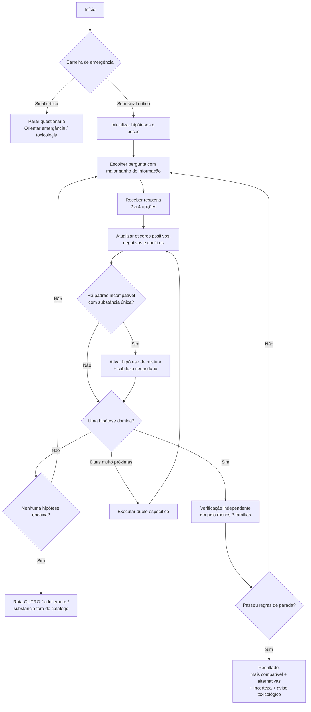
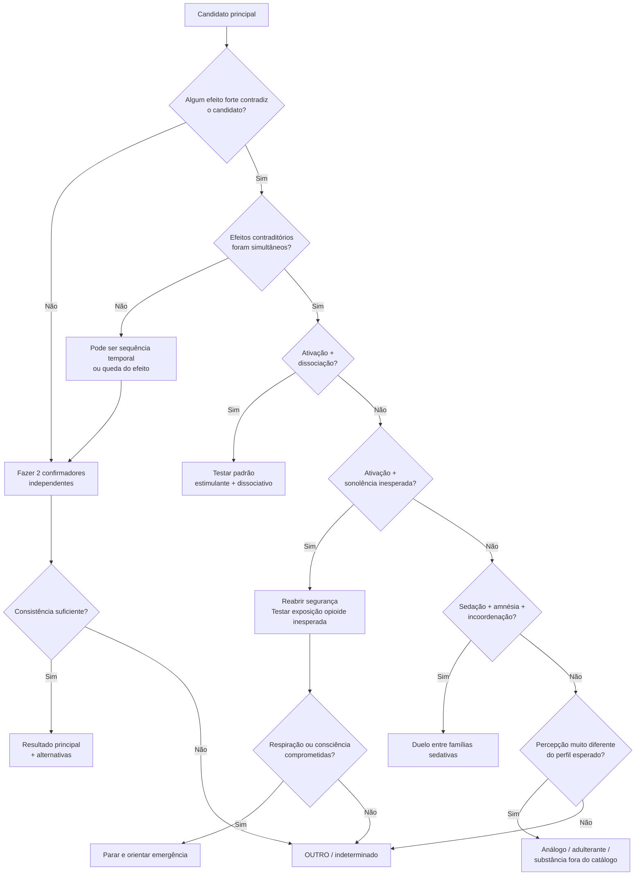

# Projeto de questionário adaptativo “Akinator de efeitos” para inferência probabilística de substâncias

## Resumo executivo

É tecnicamente possível construir um questionário **estilo Akinator** que, sem citar nomes de substâncias, aparência, forma, cor, via de uso ou quantidade nas perguntas, vá reduzindo hipóteses a partir de padrões subjetivos e funcionais: ativação versus sedação, dissociação, alterações perceptivas, conexão emocional, coordenação, memória, analgesia, duração percebida, sono, apetite, tensão mandibular, curso temporal e combinação de efeitos aparentemente contraditórios.

O produto, porém, deve ser apresentado como **classificador probabilístico de padrões de efeitos**, não como identificador toxicológico ou diagnóstico. A mesma substância pode produzir experiências diferentes conforme quantidade, concentração real, tolerância, interações, contexto e características individuais; e substâncias diferentes podem produzir toxidromes muito semelhantes. As autoridades toxicológicas tratam intoxicação como um problema no qual sinais clínicos, histórico e, quando necessário, exames laboratoriais precisam ser integrados. citeturn16search2turn16search8

A estrutura fornecida no arquivo-base já contém uma boa ideia central: um *router* curto, baterias confirmatórias, “duelos” entre hipóteses parecidas e uma barreira de emergência antes do jogo. fileciteturn0file0 A principal mudança recomendada é substituir o critério rígido **“5 de 6 = lock; 6 de 6 = certeza”** por evidência ponderada e um resultado formulado como **“padrão mais compatível com…”**. Nenhum número de respostas subjetivas torna a composição química “certa”.

Há ainda duas correções estruturais indispensáveis.

Primeiro, **“heroína/crack” não deve existir como uma única hipótese interna**. Heroína é um opioide de ação rápida, associado a sedação, analgesia, sonolência e depressão respiratória; crack é uma forma de cocaína e pertence ao padrão estimulante. citeturn20search0turn20search1 Para preservar exatamente a taxonomia solicitada, o aplicativo pode continuar exibindo a letra **i**, mas o motor precisa manter dois estados latentes: `i-H` = padrão opioide semelhante a heroína e `i-C` = padrão estimulante muito breve semelhante a crack.

Segundo, **fentanil versus heroína não pode ser resolvido com confiança por “como a pessoa se sentiu”**. Fentanil e heroína compartilham sedação, euforia/relaxamento, analgesia e depressão respiratória; a própria DEA descreve o fentanil como produzindo efeitos semelhantes aos de outros opioides, e o CDC destaca que sua presença pode ser desconhecida e que identificação confiável requer teste. citeturn17search0turn17search1 Portanto, `j = fentanil` pode ser uma hipótese provisória dentro do conjunto fechado, mas a interface deve limitar sua certeza a algo como **“padrão opioide potente; fentanil é uma possibilidade”** até haver confirmação analítica.

O mesmo princípio vale, em menor grau, para **cocaína versus crack**: crack é cocaína base. Sem perguntar via de administração — uma restrição desejada aqui — intensidade e brevidade do pico podem mudar a classificação relativa, mas não são provas químicas suficientes. citeturn20search1

A combinação **ketamina + cocaína**, por outro lado, pode ser modelada como uma hipótese de mistura quando aparecem simultaneamente dois eixos incomuns em conjunto: **forte ativação estimulante + dissociação/entorpecimento/alteração espacial**. Isso é uma inferência de padrão, não confirmação de quais duas moléculas estavam presentes. Ketamina produz dissociação, sensação de desconexão do corpo, analgesia, incoordenação e alterações perceptivas; cocaína produz um padrão estimulante. citeturn19search0turn20search1

O desenho recomendado é, portanto:

| Camada | Função |
|---|---|
| Segurança | interromper imediatamente diante de sinais de emergência |
| Router adaptativo | descobrir o eixo dominante: estimulação, sedação, psicodelia, dissociação ou padrão misto |
| Discriminação | escolher a próxima pergunta que mais separa as hipóteses ainda plausíveis |
| Confirmação | buscar evidência em pelo menos três famílias independentes de características |
| Duelo | separar as duas hipóteses mais próximas |
| Mistura/adulterante | procurar efeitos incompatíveis com uma substância única |
| “Outro” | reconhecer quando nenhuma hipótese do catálogo explica bem o padrão |
| Resultado | mostrar ranking e incerteza; nunca declarar confirmação química |

A barreira de segurança é obrigatória. No Brasil, perda de consciência, convulsões, dor torácica e intoxicações são situações compatíveis com acionamento do **SAMU pelo 192**; para orientação toxicológica, a Anvisa mantém o **Disque-Intoxicação 0800-722-6001**, com encaminhamento a centros toxicológicos e atendimento contínuo. citeturn16search1turn16search6 Em suspeita de overdose opioide, incapacidade de despertar e respiração lenta ou superficial são sinais particularmente críticos. citeturn17search4turn17search15

## Evidência, limites e correções do protótipo

O classificador funciona melhor quando pensa em **dimensões ocultas** em vez de frases estereotipadas sobre cada droga. “Visual de natureza” versus “geometria”, por exemplo, pode aparecer em relatos, mas é uma característica subjetiva demais para carregar peso alto. Já dissociação corporal, duração muito longa de alterações perceptivas, incapacidade de dormir por muitas horas, perda de coordenação, amnésia e analgesia pertencem a famílias mais mecanisticamente informativas.

A literatura oficial sustenta alguns contrastes robustos. MDMA frequentemente combina energia, euforia, afeição social, sentidos aumentados e tensão/ranger mandibular. citeturn19search4 Metanfetamina tende a produzir estimulação prolongada, energia e alerta, redução de apetite, insônia, ansiedade/paranoia e tensão mandibular; a Healthdirect informa que os efeitos do “ice” podem durar até cerca de 12 horas. citeturn14search1 GHB/GBL pode começar com confiança, excitação e maior sensibilidade ao toque e evoluir para desorientação, perda de coordenação, confusão ou sonolência; o início típico é rápido e os efeitos podem durar até cerca de quatro horas. citeturn19search7

Ketamina se diferencia melhor pela **dissociação**: sensação de estar desligado do corpo ou ambiente, alteração de realidade, entorpecimento, fala/coordenação prejudicadas e, às vezes, amnésia. citeturn19search0turn19search1 LSD se diferencia de psicodélicos mais curtos sobretudo pelo arco temporal: início tipicamente em dezenas de minutos e efeitos frequentemente na faixa de 8–12 horas, com alterações de tempo, lugar, sentidos e pensamento. citeturn19search3 Em estudos controlados, os efeitos subjetivos da psilocibina tendem a começar em aproximadamente 20–40 minutos e persistir por cerca de 4–6 horas, embora exista considerável variabilidade. citeturn18search4turn18search6

Para cannabis, alterações de percepção temporal, aumento dos sentidos, relaxamento/sonolência, fome e alterações de coordenação podem coexistir, mas o padrão varia consideravelmente com a preparação e forma de exposição. citeturn10search3 Álcool é mais bem separado por desinibição inicial combinada a comprometimento crescente de julgamento, fala, equilíbrio/coordenação e, em exposições maiores, memória ou nível de consciência; overdose pode causar confusão, vômitos, convulsões e respiração perigosamente alterada. citeturn7search2turn7search13

**O que não deve receber peso alto:** “cores mais vivas”, um tipo específico de imagem, “sensação espiritual”, felicidade genérica, ansiedade genérica, náusea isolada ou simplesmente “ficar sociável”. Esses atributos ocorrem em vários grupos. Alucinógenos, por exemplo, compartilham alterações sensoriais, temporais e espaciais, e ansiedade/pânico podem ocorrer em múltiplos estados. citeturn19search6

**O que deve receber peso alto:** coexistência de características independentes. Energia + forte conexão afetiva + aumento de música/toque + mandíbula tensa é muito mais informativo que “energia” isolada para MDMA. Dissociação corporal + analgesia/entorpecimento + distorção espacial + incoordenação é muito mais informativo para ketamina que “alucinação” isolada. citeturn19search4turn19search0

O desenho do arquivo-base acerta ao separar *router*, confirmação e duelos, mas o `≥5/6` deveria ser interpretado apenas como um **critério interno de consistência**, nunca como “certeza”. fileciteturn0file0 Recomenda-se ainda abandonar perguntas metafóricas como “rocket”, “hole”, “jelly” ou “living nature” na versão pt-BR destinada ao público amplo e substituí-las por frases concretas: “parecia que seu corpo estava distante?”, “você lutava para permanecer acordado?”, “o ambiente parecia se esticar ou deslocar?”.

Também é importante distinguir **ausência de evidência** de **evidência negativa**. “Não sei” deve valer `0`, não `-1`. “Não” só deve reduzir uma hipótese quando a característica era razoavelmente esperada e discriminativa.

O modelo deve aceitar que a resposta correta seja **“outro / não distinguível”**. Isso é especialmente importante porque catinonas sintéticas podem mimetizar cocaína, metanfetamina ou MDMA; análogos dissociativos podem mimetizar ketamina; benzodiazepínicos podem mimetizar parte do padrão álcool/GHB; e opioides sintéticos como nitazenos podem produzir o mesmo toxidrome respiratório que heroína/fentanil. A NSW Health documentou inclusive nitazenos em produtos esperados como outras drogas. citeturn20search5turn19search11turn17search7

## Arquitetura adaptativa e segurança

A arquitetura deve ser **Akinator-like**, e não uma árvore rígida. Em vez de sempre fazer Q1 → Q2 → Q3, o motor recalcula qual pergunta tem maior valor discriminativo diante das respostas acumuladas.

**Barreira de emergência.** Antes de qualquer classificação, o sistema deve perguntar algo como:

> **E0.** “Agora, a pessoa está muito difícil de acordar, respirando muito devagar ou de forma irregular, convulsionando, com dor forte no peito, ou extremamente quente e confusa?”  
> **Opções:** Sim / Não / Não sei.

`Sim` interrompe o jogo. `Não sei` diante de uma pessoa muito sonolenta deve favorecer cautela, não classificação. Inconsciência e respiração lenta/superficial são sinais de overdose opioide, enquanto convulsões, dor torácica e hipertermia também podem acompanhar intoxicações graves por outros agentes. citeturn17search15turn20search8 No Brasil, o fluxo operacional deve exibir `SAMU 192` e `Disque-Intoxicação 0800-722-6001`. citeturn16search1turn16search6

**Representação mínima.** Cada hipótese `d` recebe um escore oculto:

\[
S_d=b_d+\sum_f w_{d,f}x_f-\sum_c\lambda_{d,c}
\]

onde `b_d` é um prior configurável, `w` é o peso de cada característica para a hipótese, `x` é a evidência produzida pelas respostas e `λ` representa contradições importantes.

Recomenda-se a escala interna:

| Evidência | Valor-base |
|---|---:|
| fortemente presente | +2 |
| fracamente presente | +1 |
| desconhecida | 0 |
| fracamente incompatível | −1 |
| fortemente incompatível | −2 |

Os pesos específicos da hipótese multiplicam esses valores. Por exemplo, `DISS` pode receber peso `3` para ketamina, `2,5` para ketamina+cocaína, `0,5` para psicodélicos e negativo para cocaína isolada.

Para mostrar ranking, pode-se transformar os escores em uma distribuição relativa:

\[
R_d=\frac{e^{S_d/T}}{\sum_j e^{S_j/T}}
\]

Isso **não deve ser rotulado “probabilidade de você ter usado X”** sem validação empírica. O nome correto é **compatibilidade relativa do modelo**.

A próxima pergunta pode ser escolhida aproximadamente por:

\[
q^*=\arg\max_q
\left[
H(\text{hipóteses atuais})
-\mathbb E(H\mid resposta_q)
-\alpha \cdot custo(q)
\right]
\]

Assim, uma pergunta é favorecida quando divide as hipóteses ainda plausíveis em grupos diferentes. Perguntas redundantes recebem baixo valor.

**Regras de parada propostas**, exclusivamente como parâmetros de engenharia a validar:

| Estado | Regra proposta |
|---|---|
| insuficiente | menos de 6 respostas informativas |
| continuar | líder < 0,55 de compatibilidade relativa |
| duelo | diferença entre primeiro e segundo < 0,12 |
| candidato moderado | ≥7 respostas, ≥3 famílias independentes, líder ≥0,60 e margem ≥0,12 |
| candidato forte | ≥8 respostas, ≥4 famílias, líder ≥0,75 e margem ≥0,20 |
| “outro” | ≥8 respostas e nenhum candidato >0,45, ou ≥2 contradições fortes em todos |
| mistura | assinatura simultânea de ≥2 famílias farmacologicamente discordantes e modelo duplo claramente supera qualquer único |
| específico proibido | fentanil versus outros opioides e crack versus outras formas de cocaína não recebem “certeza alta” apenas por sintomas |

Esses limites são **hiperparâmetros de produto, não limites clínicos validados**. Um estudo de validação deveria calibrá-los contra resultados toxicológicos conhecidos.

A mistura merece um modelo explícito. Para um par `a+b`:

\[
S_{a+b}=S_a+S_b+\gamma I(\text{assinatura simultânea})-\delta I(\text{efeitos apenas sequenciais})
\]

A distinção entre **simultâneo** e **sequencial** é importante. “Fiquei acelerado e depois sonolento” pode representar queda de um estimulante. “Fiquei muito acelerado e ao mesmo tempo meu corpo parecia desconectado e entorpecido” é evidência muito mais interessante para um padrão estimulante+dissociativo.

## Banco compacto de perguntas

Os códigos de características abaixo são internos e nunca aparecem para a pessoa:

`ACT` ativação; `SED` sedação; `DISS` dissociação; `PSY` alteração perceptiva; `EMP` conexão afetiva; `TACT` intensificação de toque/música; `JAW` tensão mandibular; `MOT` prejuízo motor/fala; `AMN` amnésia; `ANA` analgesia; `APP+/-` fome; `INS` insônia prolongada; `TASK` foco/repetição; `PAR` ansiedade/vigilância/suspeita; `TIME` alteração temporal; `NAU` desconforto corporal; `ABR` queda abrupta; `REP` impulso de repetir; `HANG` ressaca/fog; `MIX` ativação+dissociação simultâneas; `SPACE` alteração espacial.

Todas as perguntas abaixo respeitam o limite de **2–4 opções** e não citam substância, aparência, formato, cor, via ou quantidade.

| ID | Texto apresentado ao usuário | Opções | Mapeamento interno |
|---|---|---|---|
| E0 | A pessoa está muito difícil de acordar, respirando muito devagar ou irregularmente, convulsionando, com dor forte no peito ou extremamente quente e confusa? | Sim / Não / Não sei | Sim=`EMERGÊNCIA`; Não=0; Não sei=`CAUTELA` |
| Q01 | Durante a parte principal, você se sentiu principalmente mais acelerado(a) ou mais lento(a)? | Acelerado / Lento / Os dois / Nenhum | `ACT+2`; `SED+2`; `MIX+1, ACT+1, SED+1`; 0 |
| Q02 | A mudança mais estranha aconteceu no ambiente/percepção ou na sensação de possuir o próprio corpo? | Ambiente / Corpo / Ambos / Nenhum | `PSY+2`; `DISS+2`; ambos +1,5; 0 |
| Q03 | Você se sentiu muito mais aberto(a), carinhoso(a) ou conectado(a) às pessoas? | Muito / Um pouco / Não | `EMP+2/+1/−1` |
| Q04 | Música, toque ou outras sensações ficaram excepcionalmente intensos? | Muito / Um pouco / Não | `TACT+2/+1/−1` |
| Q05 | Sua mandíbula ficou muito tensa ou os dentes ficaram apertando/rangendo? | Sim / Não / Não sei | `JAW+2/−1/0` |
| Q06 | Aproximadamente quanto durou a parte principal do efeito? | <1 h / 1–4 h / 4–7 h / ≥8 h | `DUR-S/M/H/X +2` |
| Q07 | Quando o pico terminou, ele caiu de repente ou diminuiu gradualmente? | De repente / Gradualmente / Não sei | `ABR+2`; `ABR−1`; 0 |
| Q08 | Mesmo depois do pico, dormir parecia muito difícil por muitas horas? | Sim / Não / Não sei | `INS+2/−1/0` |
| Q09 | Durante o efeito, sua fome mudou claramente? | Aumentou / Diminuiu / Igual / Não sei | `APP+ +2`; `APP− +2`; 0; 0 |
| Q10 | Seu equilíbrio, coordenação ou fala pioraram bastante? | Sim / Um pouco / Não | `MOT+2/+1/−1` |
| Q11 | Existem trechos inteiros desse período que você não consegue lembrar? | Sim / Não / Não sei | `AMN+2/−1/0` |
| Q12 | Você precisava lutar para ficar acordado(a), ou sua cabeça ficava caindo? | Sim / Um pouco / Não | `SED+2,NOD+2`; +1; `NOD−1` |
| Q13 | Dores físicas ficaram muito menos perceptíveis? | Sim / Um pouco / Não | `ANA+2/+1/−1` |
| Q14 | Sonolência veio junto de coceira ou sensação incomum na pele? | Sim / Não / Não sei | padrão opioide `+1`; 0; 0 |
| Q15 | A aceleração veio acompanhada de calor ou suor muito intensos? | Sim / Um pouco / Não | `ACT+1,HEAT+2`; +1; 0; intensidade extrema reabre E0 |
| Q16 | O estado mental parecia mais foco repetitivo, mais vigilância/suspeita, ou ambos? | Foco repetitivo / Vigilância / Ambos / Nenhum | `TASK+2`; `PAR+2`; ambos +2; 0 |
| Q17 | Você percebeu padrões repetitivos, rastros ou mistura incomum entre os sentidos? | Muito / Um pouco / Não | `PSY+2`; +1; −1 |
| Q18 | Durante as alterações de percepção, houve náusea ou sensação corporal desconfortável marcante? | Sim / Não / Não sei | `NAU+2/−1/0` |
| Q19 | Sua noção de tempo ficou muito alterada? | Muito / Um pouco / Não | `TIME+2/+1/−1` |
| Q20 | Parecia que seu corpo estava distante, não era totalmente seu, ou que você o observava de fora? | Sim / Um pouco / Não | `DISS+2/+1/−2` |
| Q21 | O espaço parecia esticar, inclinar, deslizar ou mudar de proporção? | Muito / Um pouco / Não | `SPACE+2/+1/−1` |
| Q22 | Você estava acelerado(a) e, ao mesmo tempo, desconectado(a), entorpecido(a) ou “fora” do corpo? | Sim / Parcialmente / Não | `MIX+3/+1/−2` |
| Q23 | O impulso predominante era conexão com pessoas ou continuar fazendo/focando em algo? | Pessoas / Atividade / Ambos / Nenhum | `EMP+2`; `TASK+2`; ambos +1; 0 |
| Q24 | Quando o pico caiu, veio vontade forte de recuperar aquela sensação logo? | Sim / Não / Não sei | `REP+2/−1/0` |
| Q25 | O auge pareceu extremamente intenso e muito breve em comparação ao restante? | Sim / Não / Não sei | `DUR-S+2,ABR+1`; −1; 0 |
| Q26 | Depois, predominaram cabeça pesada, náusea, cansaço ou lentidão por bastante tempo? | Sim / Um pouco / Não | `HANG+2/+1/−1` |
| Q27 | Relaxamento, sensação de tempo mais lento e aumento da fome apareceram juntos? | Os três / Um ou dois / Nenhum | `CAN-pattern+3/+1/−2` |
| Q28 | As alterações fortes de percepção permaneceram por oito horas ou mais? | Sim / Não / Não sei | `DUR-X+3`; `DUR-X−2`; 0 |
| Q29 | Houve uma fase de desinibição ou bem-estar seguida de queda muito abrupta de consciência ou memória? | Sim / Parcialmente / Não | `CLIFF+3/+1/−2` |
| Q30 | Depois de forte aceleração, apareceu uma sonolência inesperada e difícil de explicar? | Sim / Não / Não sei | `MIX-DEP+3`; −1; 0; reavaliar E0 |

Perguntas como Q03, Q04 e Q05 são particularmente úteis para o padrão MDMA, porque afeição social, intensificação sensorial e tensão mandibular são documentadas em conjunto; nenhuma delas isoladamente é específica. citeturn19search4 Q20/Q21 ajudam a isolar dissociação, característica central da ketamina. citeturn19search0turn19search2 Q28 é valiosa no duelo LSD–psilocibina porque o LSD frequentemente permanece ativo por 8–12 horas, enquanto estudos controlados de psilocibina encontram duração média aproximadamente na faixa de 4–6 horas. citeturn19search3turn18search4

Q30 tem valor de segurança especial. A NSW Health relatou, inclusive em março de 2026, overdoses opioides após pessoas usarem produtos que acreditavam ser cocaína; sonolência inesperada, perda de consciência e respiração reduzida após um padrão que deveria ser estimulante justificam imediatamente pensar em exposição opioide inesperada em vez de simplesmente “queda do estimulante”. citeturn17search12turn17search13

## Matriz discriminativa, tempo, emergências e confundidores

A matriz abaixo deve orientar **pesos**, não funcionar como checklist diagnóstico.

| Alvo | Características mais discriminativas | Início/duração típica útil ao motor | Confundidores importantes | Fontes |
|---|---|---|---|---|
| **a · cocaína** | ativação, alerta/confiança, ansiedade/inquietação, redução de apetite, pico/queda relativamente curtos, pouca dissociação | efeitos podem ir de minutos a poucas horas; fortemente dependente da exposição | crack; metanfetamina; MDMA; catinonas; cafeína/estimulantes | citeturn20search1turn10search1 |
| **b · álcool** | desinibição → lentificação; fala/coordenação prejudicadas; memória comprometida; ressaca/fog posterior | início em minutos; duração varia com padrão de consumo; efeitos posteriores podem persistir muitas horas | GHB, benzodiazepínicos, outros sedativos | citeturn7search2turn7search13 |
| **c · MDMA** | energia + afeição/conexão + intensificação de toque/música + mandíbula tensa; mundo geralmente ainda reconhecível | ~20–60 min; parte principal ≥3–4 h, frequentemente várias horas | metanfetamina, catinonas, LSD/psicodélicos, misturas | citeturn19search4 |
| **d · crystal meth** | energia/alerta intensos, vigília prolongada, pouca fome, fala/foco repetitivo, ansiedade/paranoia, mandíbula | pode durar até ~12 h; pós-efeitos e dificuldade de dormir podem durar mais | cocaína, anfetaminas, catinonas, MDMA | citeturn14search1turn19search5 |
| **e · GHB/GBL** | confiança/desinibição + sensibilidade tátil; depois sonolência, desorientação, incoordenação e amnésia; transição pode ser abrupta | ~5–20 min; até ~4 h | álcool, benzodiazepínicos, opioides, outros sedativos | citeturn19search7 |
| **f · cannabis/relacionados** | relaxamento, alteração temporal/sensorial, fome, riso/quietude, possível ansiedade/paranoia, coordenação prejudicada | muito dependente da preparação e exposição; efeitos podem persistir horas | psicodélicos em baixa intensidade; sedativos; canabinoides sintéticos | citeturn10search3 |
| **g · psilocibina** | alteração perceptiva intensa + tempo alterado + experiência emocional/cognitiva + náusea/carga corporal relativamente comum | ≈20–40 min em estudos controlados; tipicamente ≈4–6 h | LSD, outros psicodélicos, espécies tóxicas de cogumelos | citeturn15search0turn18search4turn18search6 |
| **h · LSD** | percepção/sinestesia + tempo/espaço muito alterados + pensamentos intensos; arco marcadamente longo | ~20–90 min; ~8–12 h | psilocibina e outros psicodélicos | citeturn19search3 |
| **i-H · heroína** | sedação, analgesia, sensação de peso/conforto, “nodding”, redução de alerta; risco respiratório | opioide de ação rápida; efeitos agudos duram horas | fentanil, nitazenos, outros opioides, sedativos | citeturn20search0turn17search7 |
| **i-C · crack** | estimulante intenso, auge muito breve e queda rápida, impulso de repetir; essencialmente espectro da cocaína | tipicamente mais abrupto/curto, mas isso depende de via e não deve ser tratado como prova | cocaína em outras exposições; estimulantes sintéticos | citeturn20search1 |
| **j · fentanil** | padrão opioide com sedação/analgesia e potencial depressão de consciência/respiração; **não há assinatura subjetiva exclusiva** | início pode ser rápido; duração depende da exposição e formulação | heroína, nitazenos, outros opioides | citeturn17search0turn17search1 |
| **k · ketamina** | dissociação corporal, alteração espacial, entorpecimento/analgesia, incoordenação, fala alterada, amnésia possível | ~30 s–20 min conforme exposição; ~45 min–3 h | outros dissociativos, álcool/sedativos, psicodélicos | citeturn19search1turn19search2 |
| **l · ketamina+cocaína** | ativação estimulante **simultânea** a dissociação, entorpecimento/alteração espacial e incoordenação | não existe uma janela única confiável; depende da sobreposição dos dois componentes | outros estimulantes+dissociativos, análogos de ketamina, mistura sequencial | inferência apoiada pelos perfis individuais: citeturn19search0turn20search1 |

A coluna temporal deve ser usada com peso **moderado**, porque quantidade, formulação, metabolismo, tolerância, interações e forma de exposição modificam início e duração. A variação individual é explicitamente destacada em fontes clínicas para MDMA, GHB, LSD, ketamina e metanfetamina. citeturn19search4turn19search7turn19search3turn19search1turn14search1

**Sugestão de visual para a interface de operador:** uma linha do tempo horizontal, não mostrada antes das respostas para evitar indução, com eixo logarítmico ou segmentos `<1 h`, `1–4 h`, `4–7 h`, `8–12 h`, `>12 h`. Ela mostraria apenas faixas largas. O contraste visual mais útil seria ketamina/efeitos muito breves em uma extremidade, GHB/MDMA/psilocibina no meio e LSD/metanfetamina na faixa longa. Essas faixas não devem ser usadas isoladamente para identificar uma substância. citeturn19search1turn19search7turn19search4turn18search4turn19search3turn14search1

A tabela seguinte separa **red flags** do que é apenas discriminativo:

| Achado | Ação do produto | Motivo |
|---|---|---|
| impossível ou muito difícil acordar | interromper imediatamente | overdose grave possível, especialmente opioide/sedativo citeturn17search15 |
| respiração lenta, superficial, irregular, roncos/gorgolejos em pessoa não despertável | interromper imediatamente | sinal clássico de overdose opioide; risco vital citeturn17search4turn17search15 |
| convulsão | interromper | emergência toxicológica/neurológica citeturn16search6turn20search8 |
| dor torácica forte | interromper | complicação cardiovascular possível, inclusive em estimulantes citeturn16search6turn20search8 |
| temperatura muito alta + confusão/agitação importante | interromper | toxicidade grave possível; estimulantes podem comprometer regulação térmica citeturn17search17turn20search8 |
| sonolência inesperada após forte aceleração | reabrir E0 e ativar subfluxo de exposição inesperada | opioides já foram encontrados em produtos esperados como estimulantes citeturn17search12turn17search13 |
| alteração perceptiva sem red flags | continuar classificação | inespecífica entre alucinógenos/dissociativos citeturn19search6 |
| mandíbula tensa isoladamente | continuar; peso baixo-médio | ocorre em MDMA e estimulantes citeturn19search4turn19search5 |

O motor deve manter uma matriz explícita de **confundidores**:

| Duelo | Perguntas mais úteis | Limite inevitável |
|---|---|---|
| cocaína × metanfetamina | Q06, Q08, Q16, Q24 | duração/vigília pesam para metanfetamina; não são prova |
| cocaína × MDMA | Q03, Q04, Q05, Q23 | empatia + toque/música têm maior peso para MDMA |
| cocaína × crack | Q25, Q07, Q24 | distinção fraca sem informação sobre exposição; ambos são cocaína citeturn20search1 |
| álcool × GHB | Q07, Q11, Q29, Q26 | ambos podem causar incoordenação, sedação e amnésia |
| GHB × opioide | Q12, Q13, Q14, Q29 | analgesia/nodding favorecem opioide; queda abrupta após desinibição favorece GHB |
| heroína × fentanil | essencialmente nenhum conjunto subjetivo confiável | requer confirmação externa; ambos compartilham toxidrome opioide citeturn20search0turn17search0 |
| opioide × nitazeno | nenhum questionário subjetivo confiável | nitazenos também podem produzir sonolência, perda de consciência e respiração lenta citeturn17search7 |
| psilocibina × LSD | Q06, Q28, Q18 | duração longa favorece LSD; náusea/carga corporal ajuda pouco, não confirma |
| psicodélico × ketamina | Q20, Q21, Q13, Q10 | perda de propriedade corporal/analgesia/incoordenação favorecem dissociativo |
| ketamina × ketamina+cocaína | Q01, Q22, Q24 | ativação simultânea à dissociação favorece mistura |
| cannabis × psicodélico | Q17, Q19, Q27 | fome + alteração temporal leve favorece cannabis; percepção sustentada intensa favorece psicodélico |
| qualquer alvo × “outro” | contradições globais + baixa pontuação | catálogo nunca deve ser assumido completo |

## Biblioteca de fluxos e diagramas por alvo

Os fluxos seguintes são **rotas de nomeação de candidato**, não provas. Depois de qualquer rota, o sistema deve fazer 2–4 perguntas adicionais de outra família antes de apresentar a hipótese. Eles expandem a lógica do arquivo original de seis caminhos por código para **dez caminhos distintos por alvo**, preservando a ideia de múltiplas entradas para o mesmo candidato. fileciteturn0file0

Notação compacta: `A`=acelerado, `L`=lento, `B`=ambos; `P`=ambiente/percepção, `D`=corpo/dissociação. Valores como `Q06=<1h` correspondem diretamente ao banco acima.

| Alvo | Dez caminhos independentes de confirmação/nomeação |
|---|---|
| **a · cocaína** citeturn20search1 | **A1** Q01=A → Q23=atividade → Q06=1–4h → Q07=brusca → Q24=sim. **A2** Q01=A → Q25=sim → Q06=<1h → Q24=sim → Q02=nenhum. **A3** Q01=A → Q03=não → Q08=não → Q07=brusca → Q17=não. **A4** Q01=A → Q16=vigilância → Q06≤4h → Q24=sim. **A5** Q01=A → Q09=diminuiu → Q08=não → Q02=nenhum → Q24=sim. **A6** Q01=A → Q23=atividade → Q04=não → Q03=não → Q07=brusca. **A7** Q01=A → Q16=ambos → Q06=1–4h → Q08=não → Q20=não. **A8** Q01=A → Q25=sim → Q22=não → Q20=não → Q24=sim. **A9** Q01=A → Q17=não → Q28=não → Q07=brusca → Q24=sim. **A10** Q01=A → Q03=não → Q20=não → Q08=não → Q26=sim/leve. |
| **b · bebidas alcoólicas** citeturn7search2turn7search13 | **B1** Q01=L → Q10=sim → Q26=sim → Q02=nenhum. **B2** Q01=B → Q10=sim → Q07=gradual → Q26=sim. **B3** Q01=L → Q11=sim → Q10=sim → Q29=não. **B4** Q23=pessoas → Q01=L → Q10=sim → Q26=sim. **B5** Q01=L → Q10=sim → Q20=não → Q17=não. **B6** Q01=B → Q07=gradual → Q11=parcial/sim → Q26=sim. **B7** Q10=sim → Q02=nenhum → Q12=um pouco → Q26=sim. **B8** Q01=L → Q06=1–4h/4–7h → Q10=sim → Q29=não. **B9** Q11=sim → Q07=gradual → Q26=sim → Q20=não. **B10** Q01=L → Q03=um pouco → Q10=sim → Q17=não → Q26=sim. |
| **c · MDMA/ecstasy** citeturn19search4 | **C1** Q01=A → Q03=muito → Q04=muito → Q05=sim → Q06=4–7h. **C2** Q23=pessoas → Q04=muito → Q05=sim → Q01=A. **C3** Q01=A → Q03=muito → Q20=não → Q04=muito → Q08=sim/leve. **C4** Q02=P leve → Q03=muito → Q04=muito → Q28=não. **C5** Q01=B → Q22=não → Q03=muito → Q05=sim. **C6** Q15=sim → Q01=A → Q03=muito → Q04=muito. **C7** Q09=diminuiu → Q05=sim → Q23=pessoas → Q06=4–7h. **C8** Q17=um pouco → Q20=não → Q03=muito → Q04=muito. **C9** Q01=A → Q16=nenhum/vigilância leve → Q23=pessoas → Q05=sim. **C10** Q03=muito → Q04=muito → Q28=não → Q20=não → Q05=sim. |
| **d · crystal meth** citeturn14search1 | **D1** Q01=A → Q08=sim → Q16=foco → Q09=diminuiu → Q06=≥8h. **D2** Q01=A → Q23=atividade → Q08=sim → Q16=ambos. **D3** Q01=A → Q06=≥8h → Q03=não → Q16=vigilância. **D4** Q09=diminuiu → Q08=sim → Q05=sim → Q16=foco. **D5** Q01=A → Q07=gradual → Q08=sim → Q24=sim/não importa. **D6** Q16=ambos → Q01=A → Q06=≥8h → Q20=não. **D7** Q23=atividade → Q09=diminuiu → Q08=sim → Q28=não. **D8** Q01=A → Q15=sim → Q08=sim → Q16=vigilância. **D9** Q01=A → Q03=não → Q04=não/leve → Q08=sim → Q06=≥8h. **D10** Q05=sim → Q16=foco → Q08=sim → Q26=sim → Q01=A. |
| **e · GHB/GBL** citeturn19search7 | **E1** Q01=L → Q29=sim → Q11=sim → Q10=sim → Q06=1–4h. **E2** Q01=B → Q29=sim → Q07=brusca → Q11=sim. **E3** Q23=pessoas → Q01=L → Q29=sim → Q10=sim. **E4** Q04=muito/leve → Q10=sim → Q11=sim → Q29=sim. **E5** Q01=L → Q12=sim → Q13=não → Q29=sim. **E6** Q01=B → Q11=sim → Q20=não → Q07=brusca. **E7** Q10=sim → Q06=1–4h → Q26=não/leve → Q29=sim. **E8** Q03=um pouco → Q01=L → Q11=sim → Q07=brusca. **E9** Q01=L → Q20=não → Q17=não → Q29=sim → Q11=sim. **E10** Q01=B → Q04=um pouco → Q10=sim → Q29=sim → Q13=não. |
| **f · cannabis e relacionados** citeturn10search3 | **F1** Q01=L/nenhum → Q27=três → Q19=muito → Q06=1–4h. **F2** Q09=aumentou → Q19=muito → Q17=leve → Q20=não. **F3** Q27=três → Q10=leve → Q02=P leve → Q28=não. **F4** Q01=L → Q09=aumentou → Q17=leve/não → Q20=não. **F5** Q19=muito → Q27=um/dois → Q06=1–4h → Q03=leve. **F6** Q01=nenhum/L → Q02=P leve → Q09=aumentou → Q28=não. **F7** Q27=três → Q17=não/leve → Q03=um pouco → Q10=leve. **F8** Q09=aumentou → Q01=L → Q19=muito → Q08=não. **F9** Q02=P → Q17=leve → Q27=três → Q20=não. **F10** Q01=L → Q27=um/dois → Q26=leve → Q28=não → Q20=não. |
| **g · psilocibina** citeturn15search0turn18search4 | **G1** Q02=P → Q17=muito → Q19=muito → Q18=sim → Q06=4–7h. **G2** Q02=P → Q06=4–7h → Q28=não → Q18=sim. **G3** Q17=muito → Q19=muito → Q20=não/leve → Q06=4–7h. **G4** Q02=P → Q18=sim → Q28=não → Q20=não. **G5** Q19=muito → Q17=muito → Q06=4–7h → Q08=não/leve. **G6** Q01=nenhum/B leve → Q02=P → Q18=sim → Q28=não. **G7** Q17=muito → Q23=nenhum/pessoas → Q19=muito → Q06=4–7h. **G8** Q02=P → Q21=leve → Q20=não → Q18=sim → Q06=4–7h. **G9** Q19=muito → Q18=sim → Q28=não → Q17=muito. **G10** Q02=P → Q17=muito → Q06=4–7h → Q20=não → Q09=igual/diminuiu. |
| **h · LSD** citeturn19search3 | **H1** Q02=P → Q17=muito → Q28=sim → Q19=muito. **H2** Q28=sim → Q19=muito → Q17=muito → Q20=não. **H3** Q02=P → Q06=≥8h → Q08=sim → Q17=muito. **H4** Q19=muito → Q28=sim → Q21=sim → Q20=não. **H5** Q17=muito → Q06=≥8h → Q18=não/leve → Q08=sim. **H6** Q01=A leve → Q02=P → Q28=sim → Q03=não/variável. **H7** Q02=P → Q19=muito → Q06=≥8h → Q20=não. **H8** Q17=muito → Q21=muito → Q28=sim → Q13=não. **H9** Q02=P → Q08=sim → Q28=sim → Q18=não. **H10** Q19=muito → Q17=muito → Q28=sim → Q22=não. |
| **i · heroína/crack — família H e C separadas internamente** citeturn20search0turn20search1 | **I1-H** Q01=L → Q12=sim → Q13=sim → Q14=sim → Q20=não. **I2-H** Q12=sim → Q13=sim → Q02=nenhum → Q29=não. **I3-H** Q01=L → Q13=sim → Q11=leve → Q17=não. **I4-H** Q12=sim → Q14=sim → Q10=leve → Q13=sim. **I5-H** Q01=L → Q20=não → Q13=sim → Q12=sim. **I6-C** Q01=A → Q25=sim → Q06=<1h → Q24=sim. **I7-C** Q25=sim → Q07=brusca → Q24=sim → Q20=não. **I8-C** Q01=A → Q06=<1h → Q03=não → Q24=sim. **I9-C** Q01=A → Q17=não → Q25=sim → Q07=brusca. **I10-C** Q25=sim → Q22=não → Q24=sim → Q06=<1h. |
| **j · fentanil — sempre provisório** citeturn17search0turn17search1 | **J1** Q01=L → Q12=sim → Q13=sim → Q07=brusca → E0=não. **J2** Q12=sim → Q11=sim → Q13=sim → Q29=não → E0=não. **J3** Q01=L → Q12=sim → Q14=sim → Q20=não → E0=não. **J4** Q12=sim → Q13=sim → Q10=leve → Q17=não → E0=não. **J5** Q01=L → Q11=sim → Q12=sim → Q29=não → E0=não. **J6** Q01=L → Q13=sim → Q06=<1h/1–4h → Q20=não → E0=não. **J7** Q12=sim → Q02=nenhum → Q13=sim → Q17=não → E0=não. **J8** Q01=L → Q07=brusca → Q12=sim → Q13=sim → E0=não. **J9** Q11=sim → Q12=sim → Q14=sim → Q29=não → E0=não. **J10** Q01=L → Q13=sim → Q20=não → Q12=sim → E0=não. **Todos terminam em “padrão opioide potente; j é possibilidade”, nunca confirmação específica.** |
| **k · ketamina** citeturn19search0turn19search1 | **K1** Q02=D → Q20=sim → Q21=muito → Q10=sim → Q06=1–4h. **K2** Q20=sim → Q13=sim → Q10=sim → Q01=L/nenhum. **K3** Q02=ambos → Q20=sim → Q21=muito → Q22=não. **K4** Q01=L → Q20=sim → Q13=sim → Q17=leve. **K5** Q21=muito → Q20=sim → Q10=sim → Q28=não. **K6** Q02=D → Q13=sim → Q11=sim/leve → Q06≤4h. **K7** Q20=sim → Q21=muito → Q17=leve → Q08=não. **K8** Q10=sim → Q13=sim → Q20=sim → Q01=nenhum/L. **K9** Q02=D → Q19=muito → Q20=sim → Q28=não. **K10** Q20=sim → Q22=não → Q13=sim → Q10=sim → Q24=não. |
| **l · ketamina+cocaína** — inferência de mistura citeturn19search0turn20search1 | **L1** Q01=B → Q22=sim → Q20=sim → Q24=sim → Q10=sim. **L2** Q01=A → Q22=sim → Q21=muito → Q24=sim. **L3** Q02=D → Q22=sim → Q01=A → Q07=brusca. **L4** Q20=sim → Q01=A → Q10=sim → Q24=sim. **L5** Q01=B → Q13=sim → Q22=sim → Q16=vigilância. **L6** Q21=muito → Q22=sim → Q01=A → Q20=sim. **L7** Q01=A → Q25=sim → Q20=sim → Q22=sim. **L8** Q10=sim → Q20=sim → Q01=A → Q24=sim. **L9** Q02=ambos → Q22=sim → Q06≤4h → Q24=sim. **L10** Q01=B → Q21=muito → Q20=sim → Q16=vigilância → Q22=sim. |

Assim, há **120 rotas de nomeação**: dez para cada um dos doze rótulos externos solicitados. A família `i` contém cinco rotas opioides e cinco rotas crack-like porque fundi-las farmacologicamente destruiria o valor discriminativo. Para produção, cada uma dessas dez rotas deve desembocar numa pequena bateria adaptativa diferente, e não repetir mecanicamente seis perguntas fixas.

O diagrama abaixo resume, por alvo, o que cada subfluxo está procurando. Os títulos são informação interna do operador; os nós representam características, não texto que precise ser mostrado literalmente ao usuário.

```mermaid
flowchart LR

subgraph A["a · cocaína"]
 A0["ativação"] --> A1["pico relativamente curto"]
 A1 --> A2["pouca dissociação"]
 A2 --> A3["queda + possível impulso de repetir"]
end

subgraph B["b · álcool"]
 B0["desinibição"] --> B1["coordenação/fala pioram"]
 B1 --> B2["lentificação gradual"]
 B2 --> B3["fog / memória / ressaca"]
end

subgraph C["c · MDMA"]
 C0["energia"] --> C1["conexão afetiva"]
 C1 --> C2["toque/música intensos"]
 C2 --> C3["mandíbula + várias horas"]
end

subgraph D["d · metanfetamina"]
 D0["ativação intensa"] --> D1["foco/repetição"]
 D1 --> D2["vigília prolongada"]
 D2 --> D3["pouca fome / tensão / suspeita"]
end

subgraph E["e · GHB/GBL"]
 E0["desinibição/bem-estar"] --> E1["incoordenação"]
 E1 --> E2["sedação"]
 E2 --> E3["amnésia ou queda abrupta"]
end

subgraph F["f · cannabis"]
 F0["relaxamento"] --> F1["tempo alterado"]
 F1 --> F2["fome/sensações"]
 F2 --> F3["alteração perceptiva geralmente moderada"]
end

subgraph G["g · psilocibina"]
 G0["percepção intensa"] --> G1["tempo alterado"]
 G1 --> G2["carga corporal/náusea possível"]
 G2 --> G3["arco de algumas horas"]
end

subgraph H["h · LSD"]
 H0["percepção intensa"] --> H1["tempo/espaço alterados"]
 H1 --> H2["padrões/sinestesia"]
 H2 --> H3["arco muito longo"]
end

subgraph IH["i-H · heroína"]
 IH0["sedação"] --> IH1["analgesia/peso"]
 IH1 --> IH2["nodding"]
 IH2 --> IH3["padrão opioide"]
end

subgraph IC["i-C · crack"]
 IC0["ativação intensa"] --> IC1["auge muito breve"]
 IC1 --> IC2["queda rápida"]
 IC2 --> IC3["espectro da cocaína"]
end

subgraph J["j · fentanil"]
 J0["padrão opioide"] --> J1["queda de alerta"]
 J1 --> J2["risco respiratório"]
 J2 --> J3["específico somente provisório"]
end

subgraph K["k · ketamina"]
 K0["corpo desconectado"] --> K1["espaço distorcido"]
 K1 --> K2["entorpecimento/analgesia"]
 K2 --> K3["incoordenação/dissociação"]
end

subgraph L["l · ketamina + cocaína"]
 L0["ativação"] --> L1["simultânea a dissociação"]
 L1 --> L2["corpo/espaço alterados"]
 L2 --> L3["hipótese de mistura"]
end
```

Esse mapa é coerente com as assinaturas clínicas gerais de estimulantes, opioides, psicodélicos, sedativos e dissociativos nas fontes oficiais, mas sua função é **engenharia de decisão**, não diagnóstico. citeturn20search0turn20search1turn19search0turn19search4turn19search6

## Verificação secundária, exemplos e implantação

Depois que o candidato principal emerge, o sistema não deve imediatamente mostrar o nome. Deve primeiro perguntar: **“há algo no relato que o candidato não explica?”**. Essa segunda etapa é onde o sistema ganha capacidade de descobrir misturas, adulteração ou substâncias fora do catálogo.

O subfluxo recomendado é:

Um pequeno banco secundário pode ser suficiente:

| ID | Pergunta secundária | Opções | Uso |
|---|---|---|---|
| V01 | “Alguma parte forte da experiência parecia o oposto do restante?” | Sim / Não / Não sei | abre busca de mistura |
| V02 | “Esses dois efeitos aconteceram ao mesmo tempo ou um depois do outro?” | Ao mesmo tempo / Um depois / Não sei | simultâneo pesa para mistura |
| V03 | “Enquanto estava acelerado(a), seu corpo também parecia distante ou entorpecido?” | Sim / Não / Não sei | estimulante+dissociativo |
| V04 | “Depois de estar muito acelerado(a), surgiu sonolência incomum ou dificuldade de manter-se acordado(a)?” | Sim / Não / Não sei | exposição depressora/opioide inesperada |
| V05 | “A intensidade pareceu muito maior ou diferente do que você esperava pelo restante da experiência?” | Sim / Não / Não sei | adulterante/análogo/outro |
| V06 | “Houve perda de memória muito maior do que a lentidão ou desorientação explicariam?” | Sim / Não / Não sei | mistura sedativa/GHB-like |
| V07 | “A alteração do corpo foi muito mais forte que a alteração visual?” | Sim / Igual / Não | dissociativo versus psicodélico |
| V08 | “Nenhuma das descrições anteriores parece representar bem o que aconteceu?” | Sim / Não / Não sei | força estado OUTRO |

V04 merece prioridade máxima. Em alertas recentes, opioides foram detectados em produtos que pessoas acreditavam ser cocaína ou outros estimulantes, inclusive com overdoses em 2026. citeturn17search12turn17search13 Fentanil também é conhecido por aparecer misturado a cocaína e metanfetamina, e pessoas podem não saber que houve exposição. citeturn17search1turn17search4

Para o estado `OUTRO`, o operador pode manter classes ocultas auxiliares sem mostrá-las como resultado principal: `outro-estimulante`, `outro-opioide`, `outro-dissociativo`, `outro-sedativo`, `outro-psicodélico` e `indeterminado`. Isso é melhor do que forçar uma das doze folhas. Catinonas sintéticas podem imitar cocaína/metanfetamina/MDMA; análogos de ketamina podem produzir dissociação ainda mais forte; e nitazenos podem gerar overdose opioide clinicamente semelhante a outros opioides potentes. citeturn20search5turn19search11turn17search7

A existência desses adulterantes também demonstra por que **“fentanil” não deve ser deduzido simplesmente porque a sedação foi intensa**. Nitazenos, heroína e outros opioides podem produzir sonolência, perda de consciência e respiração lenta. citeturn17search7turn20search0turn17search0 Confirmação química exige análise toxicológica ou teste adequado; sintomas sozinhos identificam melhor uma **classe de padrão** do que uma molécula específica.

**Cinco exemplos curtos de funcionamento**, sem simulação probabilística completa:

| Exemplo | Sequência de respostas | Resultado apropriado |
|---|---|---|
| conexão/energia | Q01=`Acelerado` → Q03=`Muito` → Q04=`Muito` → Q05=`Sim` → Q06=`4–7 h` | **MDMA/ecstasy como hipótese primária**; metanfetamina cai porque conexão afetiva e intensificação tátil predominam. Esse perfil é consistente com descrições oficiais de energia, afeição e tensão mandibular. citeturn19search4 |
| psicodélico longo | Q02=`Ambiente` → Q17=`Muito` → Q19=`Muito` → Q28=`Sim` | **LSD como hipótese primária**, com psilocibina secundária; duração ≥8 h é o maior discriminador. citeturn19search3turn18search4 |
| dissociação | Q02=`Corpo` → Q20=`Sim` → Q21=`Muito` → Q13=`Sim` → Q10=`Sim` | **Ketamina como hipótese primária**; padrão de desconexão corporal, analgesia/entorpecimento e incoordenação é compatível com um dissociativo. citeturn19search0turn19search1 |
| mistura | Q01=`Acelerado` → Q20=`Sim` → Q22=`Sim` → Q21=`Muito` → Q24=`Sim` | **Padrão misto estimulante+dissociativo; ketamina+cocaína entre as hipóteses**. A formulação correta não é “confirmado”, porque outras combinações podem produzir padrão semelhante. citeturn19search0turn20search1 |
| opioide | Q01=`Lento` → Q12=`Sim` → Q13=`Sim` → Q20=`Não` → Q14=`Sim` | **padrão opioide**. Heroína e fentanil permanecem próximas; o sistema não deve declarar qual delas foi usada. Qualquer comprometimento de respiração/consciência muda imediatamente para emergência. citeturn20search0turn17search0turn17search15 |

O resultado apresentado ao usuário deveria se parecer com:

> **Mais compatível:** MDMA/ecstasy — compatibilidade relativa moderada.  
> **Alternativas:** metanfetamina; outro estimulante/entactógeno.  
> **Por quê:** energia, conexão emocional, intensificação de toque/música e tensão mandibular apareceram juntas.  
> **Limite:** essas respostas não confirmam composição; misturas e adulterantes podem produzir padrão semelhante.

Para opioides:

> **Mais compatível:** padrão opioide.  
> **Entre os alvos disponíveis:** heroína e fentanil permanecem possíveis.  
> **Não é possível separar os dois de forma confiável apenas pela experiência subjetiva.**  
> Confirmação exige teste/análise apropriada.

Para cocaína versus crack:

> **Mais compatível:** espectro da cocaína.  
> O pico extremamente breve aumenta a compatibilidade com a subcategoria crack-like, mas essa distinção permanece incerta porque a forma de exposição não foi perguntada e crack é cocaína base. citeturn20search1

Para a combinação solicitada:

> **Mais compatível:** padrão misto estimulante + dissociativo.  
> Entre as opções fornecidas, ketamina+cocaína é a hipótese combinada de maior compatibilidade.  
> Isso não comprova que essas duas substâncias específicas estavam presentes.

**Premissas de produto ainda não especificadas.** O nível de alfabetização, idade mínima, contexto de uso e plataforma não foram definidos. Para público geral em celular, recomenda-se linguagem equivalente a aproximadamente ensino fundamental/médio, uma pergunta por tela, respostas grandes de 2–4 opções, explicação apenas após o resultado e botão de emergência persistente. Para uso por redutores de danos ou profissionais, a mesma árvore pode expor a matriz de escores, hipóteses secundárias, contradições e motivo da próxima pergunta. Para pesquisa, deve haver consentimento, versionamento das perguntas e armazenamento separado entre respostas e qualquer dado identificável.

A validação ideal é prospectiva: coletar o questionário **antes** de conhecer o resultado toxicológico, comparar ranking com análise laboratorial e medir, por classe e por substância, sensibilidade, especificidade, valor preditivo, calibração e frequência de `OUTRO`. Fentanil/heroína e crack/cocaína deveriam ser avaliados também como classes agregadas, porque os próprios perfis toxicológicos mostram a sobreposição substancial entre essas categorias. citeturn17search0turn20search0turn20search1

A implementação também deve evitar um objetivo de “ganhar o jogo”. O arquivo-base já recomenda uma barreira de emergência antes da classificação. fileciteturn0file0 A versão de produção deveria reforçar isso visualmente: **segurança primeiro, hipótese depois**. O CIATox brasileiro existe justamente para orientar público e profissionais diante de exposições tóxicas, incluindo drogas lícitas e ilícitas, e alguns centros dispõem inclusive de análise toxicológica de urgência. citeturn16search2

Em particular, qualquer combinação de incapacidade de despertar, respiração lenta ou irregular, convulsão, dor torácica ou deterioração rápida deve terminar imediatamente o fluxo classificatório. O serviço de emergência brasileiro pode ser acionado pelo **192**, e o **Disque-Intoxicação 0800-722-6001** oferece orientação toxicológica. citeturn16search1turn16search6

O resultado metodologicamente mais sólido, portanto, não é um “Akinator que sabe qual droga foi usada”, mas um **Akinator de toxidromes subjetivos e funcionais**: ele reduz hipóteses rapidamente, reconhece padrões mistos, sabe quando duas folhas são intrinsecamente indistinguíveis e, sobretudo, sabe quando deve parar de adivinhar e encaminhar para confirmação toxicológica ou atendimento de emergência.