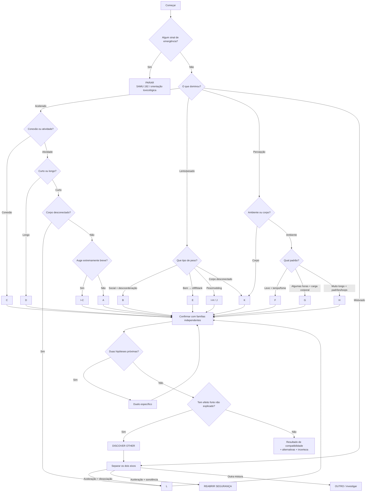

# AKINATOR DE EFEITOS — PT-BR

## 0. A regra antes de começar

A ideia aqui não é “adivinhar com certeza o que você usou”.

É mais:

**“Pelo que você sentiu, qual padrão combina mais?”**

Mistura, adulteração, tolerância, contexto e várias outras coisas podem mudar completamente a experiência.

E tem uma regra acima de todas:

### 🚨 Q00 — antes de brincar de Akinator

**Agora, você ou a pessoa tá muito difícil de acordar, respirando muito devagar/estranho, convulsionando, com dor forte no peito ou extremamente quente e confusa?**

- **Sim** → PARA AQUI.
- **Não**
- **Não sei** → se a pessoa estiver muito apagada ou respirando estranho, trata como situação séria.

Se for emergência no Brasil: **SAMU 192**.  
Orientação toxicológica: **Disque-Intoxicação 0800-722-6001**.

---

# 1. COMO O PAPO COMEÇA

## Q01

**Na parte mais forte, qual dessas descreve melhor o que rolou com você?**

- ⚡ **Eu tava acelerado**
- 🫠 **Eu tava mais lento/pesado**
- 🌈 **O mais estranho era minha percepção**
- 🔀 **Tinha duas dessas coisas ao mesmo tempo**

Essa é só a primeira pista. Não fecha nada ainda.

---

# 2. SE VOCÊ RESPONDEU “ACELERADO”

## Q02

**Essa energia parecia mais qual dessas?**

- ❤️ **Queria gente perto, carinho, música, toque**
- 🎯 **Queria falar, fazer coisa, focar, continuar**
- 🤷 **Não sei**

### Se ❤️ → abre trilha C

Antes de concluir:

**Q03. Você se sentiu MUITO mais aberto, carinhoso ou conectado com as pessoas?**

- Muito
- Um pouco
- Não

**Q04. Música, toque ou outras sensações ficaram absurdamente mais intensos?**

- Muito
- Um pouco
- Não

**Q05. Sua mandíbula ficou tensa ou você percebeu que tava apertando/rangendo os dentes?**

- Sim
- Não
- Não sei

**Q06. Quanto tempo mais ou menos durou a parte principal?**

- Menos de 1 hora
- 1–4 horas
- 4–7 horas
- 8 horas ou mais

**Q07. Mesmo com algumas alterações, você ainda reconhecia normalmente as pessoas e o lugar?**

- Sim
- Mais ou menos
- Não

### Assinatura C forte

A combinação que interessa é:

**energia + conexão emocional + música/toque muito fortes + mandíbula + ambiente ainda reconhecível.**

Não basta “eu tava feliz”.

---

### Se 🎯 em Q02 → Q08

**Foi mais um pico curto ou parecia um motor que simplesmente não desligava?**

- 🚀 **Pico relativamente curto**
- 🏎️ **Motor longo**
- 🤷 **Não sei**

---

## Se “motor longo” → trilha D

**Q09. Depois do pico, dormir continuou parecendo impossível por muitas horas?**

- Sim
- Não
- Não sei

**Q10. Sua cabeça ficava presa em tarefa, conversa, organização ou repetindo alguma coisa sem querer parar?**

- Sim
- Um pouco
- Não

**Q11. Sua fome diminuiu bastante?**

- Sim
- Não
- Não sei

**Q12. Você ficou mais desconfiado, em alerta ou sentindo que precisava prestar atenção em tudo?**

- Muito
- Um pouco
- Não

**Q13. A conexão emocional com as pessoas era meio secundária perto da vontade de continuar fazendo alguma coisa?**

- Sim
- Os dois
- Não

### Assinatura D forte

**aceleração + duração longa + sono desligado + foco/repetição + pouca fome**, às vezes com tensão ou vigilância.

---

## Se “pico curto” → Q14

**Ao mesmo tempo em que tava acelerado, seu corpo ficou meio estranho — mole, distante, desconectado ou difícil de controlar?**

- Sim
- Um pouco
- Não

### Sim → trilha L
### Não → Q15

---

## Q15

**O auge foi uma pancada MUITO intensa e muito breve comparado com o resto?**

- Sim
- Não
- Não sei

### Sim → trilha I-C
### Não → trilha A

---

# 3. TRILHA A — ACELERADO, CONFIANTE, PICO MAIS CURTO

Perguntas que vão aumentando A:

**A1. Você ficou claramente mais ligado e rápido, sem aquela sensação de sono pesado?**

- Sim
- Não
- Não sei

**A2. Veio bastante confiança, conversa ou aquela sensação de “bora, eu consigo”?**

- Sim
- Um pouco
- Não

**A3. Quando passou, caiu relativamente rápido em vez de continuar por horas e horas?**

- Sim
- Não
- Não sei

**A4. Depois da queda, deu vontade de recuperar aquela sensação logo?**

- Sim
- Não
- Não sei

**A5. O mundo continuou basicamente normal, sem seu corpo “sumir” e sem uma viagem visual forte?**

- Sim
- Mais ou menos
- Não

**A6. Amor por todo mundo + música/toque gigantes NÃO foram a parte principal?**

- Sim
- Não
- Não sei

### Dez caminhos que podem levar até A

**A-01**  
Acelerado → atividade/fala → pico curto → corpo normal → queda rápida.

**A-02**  
Acelerado → auge curto → menos de algumas horas → vontade de recuperar → pouca alteração perceptiva.

**A-03**  
Acelerado → pouca conexão emocional especial → sono ainda possível depois → queda rápida.

**A-04**  
Acelerado → alerta/vigilância → duração relativamente curta → vontade de repetir a sensação.

**A-05**  
Acelerado → fome menor → sem insônia extremamente prolongada → mundo normal.

**A-06**  
Acelerado → vontade de fazer/falar → música/toque não dominantes → queda perceptível.

**A-07**  
Acelerado → foco + vigilância → poucas horas → corpo continua sendo “seu”.

**A-08**  
Acelerado → auge intenso → SEM desconexão corporal → queda/vontade de recuperar.

**A-09**  
Acelerado → sem grandes alterações visuais → auge curto → queda.

**A-10**  
Acelerado → pouca vibe emocional → corpo normal → sono não completamente desligado.

---

# 4. TRILHA I-C — “PANCADA” MUITO BREVE

Aqui o sistema fica de propósito mais humilde.

**I-C1. O auge foi extremamente intenso e muito breve?**

- Sim
- Não
- Não sei

**I-C2. Parecia que seu corpo foi de 0 a 100 e depois perdeu força rápido?**

- Sim
- Mais ou menos
- Não

**I-C3. O mundo continuava reconhecível, sem uma viagem perceptiva grande?**

- Sim
- Não
- Não sei

**I-C4. Depois veio vontade forte de recuperar aquele pico?**

- Sim
- Não
- Não sei

**I-C5. A queda pareceu bem abrupta?**

- Sim
- Não
- Não sei

### Cinco entradas principais

**I-C01** acelerado → auge muito breve → queda rápida → vontade de recuperar.  
**I-C02** acelerado → pico muito mais curto que a fase de confiança/conversa.  
**I-C03** acelerado → intensidade enorme → esvaziamento rápido.  
**I-C04** aceleração + queda → percepção praticamente normal.  
**I-C05** pico curto → corpo não desconectado → vontade de repetir o pico.

### Importante

Essa trilha pode ficar **crack-like**, mas não “prova crack”. Ela continua muito perto do espectro de cocaína.

---

# 5. TRILHA L — ACELERADO + CORPO DESCONECTADO

Essa combinação merece uma investigação própria.

**L1. Você tava acelerado e, AO MESMO TEMPO, seu corpo parecia distante, mole ou desconectado?**

- Sim
- Parcialmente
- Não

**L2. O espaço parecia esticar, deslizar, inclinar ou mudar de tamanho?**

- Muito
- Um pouco
- Não

**L3. Mesmo assim, você ainda tinha vontade de falar, andar ou fazer alguma coisa?**

- Sim
- Um pouco
- Não

**L4. Sua coordenação ficou claramente pior?**

- Sim
- Um pouco
- Não

**L5. A aceleração e a desconexão aconteceram juntas, e não simplesmente uma depois da outra?**

- Juntas
- Uma depois
- Não sei

### Dez entradas L

**L-01** aceleração → corpo estranho → espaço estranho → vontade de continuar ativo.  
**L-02** aceleração → desconexão corporal → queda curta → ainda comunicativo.  
**L-03** percepção corporal estranha → aceleração simultânea → coordenação pior.  
**L-04** corpo distante → ainda falante/ativo → alteração espacial.  
**L-05** aceleração + analgesia/entorpecimento → desconexão simultânea.  
**L-06** espaço distorcido → aceleração → corpo distante.  
**L-07** auge estimulante → corpo simultaneamente “fora” → alteração espacial.  
**L-08** coordenação ruim → desconexão → mas ainda acelerado.  
**L-09** corpo + ambiente estranhos → aceleração → efeitos simultâneos.  
**L-10** aceleração → espaço muda → corpo distante → vigilância/atividade.

Resultado correto dessa família:

**“padrão misto estimulante + dissociativo”**

e só depois:

**“entre as opções disponíveis, ketamina + cocaína é uma hipótese compatível.”**

Nunca “confirmado”.

---

# 6. SE EM Q01 VOCÊ RESPONDEU “LENTO/PESADO”

## Q16

**Esse peso parecia mais qual dessas coisas?**

- 😴 **Sono/peso/conforto**
- 💡 **Eu tava bem e depois simplesmente apaguei/despenquei**
- 🥴 **Fiquei solto e depois descoordenado**
- 🫥 **Meu corpo parecia desconectado**

### 😴 → Q17
### 💡 → trilha E
### 🥴 → trilha B
### 🫥 → trilha K

---

# 7. Q17 — PESO/SONO

**Mesmo pesado, existia uma sensação de conforto/sonho, ou parecia mais que sua consciência simplesmente desligava?**

- ☁️ **Conforto/sonho**
- ⚫ **Só apagava**
- 🤷 **Não sei**

### ☁️ → família opioide I-H
### ⚫ → padrão opioide grave/J

---

# 8. TRILHA B — DESINIBIÇÃO + DESCOORDENAÇÃO

**B1. No começo você ficou mais solto, social ou desinibido?**

- Sim
- Um pouco
- Não

**B2. Sua fala, equilíbrio ou coordenação pioraram?**

- Muito
- Um pouco
- Não

**B3. Mesmo bagunçado, você conseguia acompanhar mais ou menos a história do que tava acontecendo?**

- Sim
- Parcialmente
- Não

**B4. O peso foi chegando gradualmente, em vez de você despencar do nada?**

- Sim
- Não
- Não sei

**B5. Depois veio cabeça pesada, enjoo, cansaço ou aquela névoa?**

- Sim
- Um pouco
- Não

### Dez entradas B

**B-01** lento → descoordenado → névoa depois.  
**B-02** primeiro mais solto → depois mais lento → coordenação ruim.  
**B-03** social → queda gradual → ainda lembra da história.  
**B-04** leve aceleração/desinibição → depois peso + equilíbrio ruim.  
**B-05** pesado → ainda consegue narrar → fala/coordenação piores.  
**B-06** calor/social → peso gradual → sem padrão de “nodding”.  
**B-07** coordenação ruim → pouca alteração perceptiva → sono depois.  
**B-08** peso por algumas horas → equilíbrio ruim → sem cliff abrupto.  
**B-09** memória prejudicada → mas queda gradual → névoa depois.  
**B-10** social → lento → coordenação pior → sem viagem visual.

---

# 9. TRILHA E — “TAVA BEM E DEPOIS SUMIU”

**E1. Antes da queda você tava se sentindo relativamente bem, solto ou social?**

- Sim
- Um pouco
- Não

**E2. A mudança pra “pesado/apagado” foi bem abrupta?**

- Sim
- Não
- Não sei

**E3. Tem um pedaço inteiro do período que simplesmente não existe na sua memória?**

- Sim
- Não
- Não sei

**E4. Isso pareceu diferente de só ficar gradualmente mais bêbado/descoordenado?**

- Sim
- Não
- Não sei

**E5. Dor diminuindo e aquela sonolência de cabeça caindo NÃO eram a história principal?**

- Sim
- Não
- Não sei

### Dez entradas E

**E-01** lento → social → cliff → memória faltando.  
**E-02** misto → bem → apagão abrupto.  
**E-03** leve aceleração/social → STOP repentino.  
**E-04** “eu tava ótimo e depois não tava mais lá”.  
**E-05** bem-estar → peso excessivo → buraco de memória.  
**E-06** falante → queda de prateleira → branco.  
**E-07** coordenação ruim → poucas horas → cliff de consciência.  
**E-08** social → memória faltando → queda rápida.  
**E-09** lento → pouca alteração visual → apagão depois de bem-estar.  
**E-10** social → sensações aumentadas → coordenação ruim → cliff.

---

# 10. FAMÍLIA I-H — PADRÃO OPIOIDE COM “NOD”

**N1. Seu corpo ficou pesado e confortável?**

- Sim
- Um pouco
- Não

**N2. Sua cabeça ficava caindo ou você precisava se esforçar pra continuar acordado?**

- Sim
- Um pouco
- Não

**N3. Dor física ou preocupação pareceram muito mais distantes?**

- Sim
- Um pouco
- Não

**N4. Veio coceira ou uma sensação estranha/quente na pele junto?**

- Sim
- Não
- Não sei

**N5. Parecia mais um estado sonhador do que uma experiência social/agitada?**

- Sim
- Não
- Não sei

### Cinco entradas I-H

**I-H01** pesado → sonolência → conforto/sonho → dor menor.  
**I-H02** sonolência → analgesia → mundo normal.  
**I-H03** pesado → pele/coceira → cabeça caindo.  
**I-H04** pequeno começo de bem-estar → derrete em sonolência.  
**I-H05** distante/confortável → ainda existe uma “história”, não um desligamento seco.

O resultado daqui deve ser:

**“padrão opioide”**

e NÃO uma molécula específica.

---

# 11. TRILHA J — ALERTA DESPENCA

Aqui segurança manda mais que classificação.

**J1. Você ficou muito sonolento muito rápido?**

- Sim
- Não
- Não sei

**J2. Quase não teve uma “experiência” antes — parecia mais que as luzes simplesmente diminuíram?**

- Sim
- Não
- Não sei

**J3. Ficar acordado virou esforço?**

- Sim
- Um pouco
- Não

**J4. Sua respiração pareceu muito lenta, rasa ou estranha?**

- Sim
- Não
- Não sei

### Se J4 = SIM

**PARA O AKINATOR.**

Isso deixa de ser “qual padrão combina?” e vira questão de segurança.

### Dez entradas J

**J-01** lento → consciência despenca → quase nenhuma história.  
**J-02** pesado antes mesmo de formar um estado emocional claro.  
**J-03** conversa impossível porque você simplesmente apaga.  
**J-04** não acelerado, não visual → só queda de alerta.  
**J-05** sem padrão social/descoordenado → queda rápida.  
**J-06** “eu fui embora” sem capítulo de conforto antes.  
**J-07** lento → analgesia → sonolência extrema.  
**J-08** queda abrupta → cabeça caindo → analgesia.  
**J-09** memória ruim → sonolência → padrão opioide.  
**J-10** lento → corpo normal → analgesia → consciência cai.

Mesmo que o catálogo tenha “fentanil”, o resultado deve dizer:

**“padrão opioide potente; fentanil é uma possibilidade entre outras.”**

Não dá pra separar heroína, fentanil, nitazenos e outros opioides com confiança só perguntando como a pessoa se sentiu.

---

# 12. TRILHA K — CORPO “DESCONECTOU”

**K1. Parecia que seu corpo tava distante, de borracha ou meio que não era seu?**

- Sim
- Um pouco
- Não

**K2. O espaço parecia esticar, inclinar, deslizar ou mudar de proporção?**

- Muito
- Um pouco
- Não

**K3. Você sentiu entorpecimento ou dor bem menos perceptível?**

- Sim
- Um pouco
- Não

**K4. Sua coordenação ou fala ficaram bem piores?**

- Sim
- Um pouco
- Não

**K5. Era mais uma alteração do corpo/espaço do que uma história visual cheia de padrões?**

- Sim
- Os dois
- Não

### Dez entradas K

**K-01** corpo distante → espaço muda → coordenação pior.  
**K-02** corpo distante → entorpecimento → pouca aceleração.  
**K-03** corpo + ambiente estranhos → sem componente estimulante forte.  
**K-04** lento → corpo distante → analgesia.  
**K-05** espaço distorcido → corpo distante → menos viagem visual longa.  
**K-06** corpo distante → analgesia → memória/coordenação afetadas.  
**K-07** corpo distante → espaço muda → efeito não extremamente longo.  
**K-08** coordenação ruim → analgesia → desconexão corporal.  
**K-09** corpo distante → tempo estranho → sem arco psicodélico muito longo.  
**K-10** corpo distante → sem aceleração simultânea → coordenação pior.

---

# 13. SE Q01 FOI “MINHA PERCEPÇÃO MUDOU”

## Q18

**A coisa mais estranha era o ambiente ou seu próprio corpo?**

- 🌈 **O ambiente**
- 🫥 **Meu corpo**
- 🔀 **Os dois**
- ➖ **Nenhum desses**

### Corpo → K
### Os dois → K ou L, dependendo de aceleração
### Ambiente → Q19

---

## Q19

**Qual dessas combina mais com a experiência?**

- 🌿 **Tudo parecia vivo/orgânico/cheio de significado**
- ♾️ **Padrões, rastros, loops, tempo completamente estranho**
- 🍿 **Era bem mais leve: tempo engraçado, relaxamento, fome**
- 🤷 **Nenhuma**

### 🌿 → G
### ♾️ → H
### 🍿 → F
### nenhuma → OUTRO

---

# 14. TRILHA F — ALTERAÇÃO MAIS LEVE

**F1. Você ficou mais relaxado do que acelerado?**

- Sim
- Mais ou menos
- Não

**F2. O tempo ficou meio elástico, tipo minutos estranhos?**

- Muito
- Um pouco
- Não

**F3. Veio mais fome que o normal?**

- Sim
- Não
- Não sei

**F4. Você alternava entre rir/falar e ficar quieto na sua?**

- Sim
- Não
- Não sei

**F5. Mesmo alterado, você ainda conseguia conversar e entender o ambiente?**

- Sim
- Mais ou menos
- Não

### Dez entradas F

**F-01** percepção → relaxamento + fome + tempo estranho.  
**F-02** fome → tempo estranho → alteração perceptiva leve.  
**F-03** relaxamento → coordenação um pouco pior → percepção leve.  
**F-04** lento → fome → pouca alteração visual forte.  
**F-05** tempo muito alterado → relaxamento → poucas horas.  
**F-06** ambiente levemente estranho → fome → sem longa viagem.  
**F-07** fome + risada/quietude → ainda conversa normalmente.  
**F-08** relaxamento → fome → tempo estranho → sono ainda possível.  
**F-09** percepção leve → fome → corpo ainda totalmente seu.  
**F-10** lento → névoa leve → sem padrões visuais intensos.

---

# 15. TRILHA G — PSICODELIA DE ALGUMAS HORAS

**G1. Superfícies, objetos ou o ambiente pareciam respirar ou estar vivos?**

- Muito
- Um pouco
- Não

**G2. Sua noção de tempo mudou muito?**

- Muito
- Um pouco
- Não

**G3. Veio uma sensação forte de significado emocional ou existencial?**

- Muito
- Um pouco
- Não

**G4. Teve náusea, peso corporal ou uma “onda” física marcante?**

- Sim
- Um pouco
- Não

**G5. A parte principal ficou mais na faixa de algumas horas do que “o dia inteiro”?**

- Sim
- Não
- Não sei

### Dez entradas G

**G-01** ambiente → percepção forte → tempo estranho → corpo/náusea → algumas horas.  
**G-02** ambiente → algumas horas → não ultrapassa muito 8h → carga corporal.  
**G-03** padrões/percepção → tempo → corpo continua seu → algumas horas.  
**G-04** ambiente → carga corporal → duração não extremamente longa.  
**G-05** tempo estranho → percepção forte → arco de algumas horas.  
**G-06** pouca aceleração → ambiente muito alterado → corpo/náusea.  
**G-07** percepção → significado → tempo estranho → algumas horas.  
**G-08** ambiente → espaço levemente estranho → corpo presente → carga corporal.  
**G-09** tempo → carga corporal → duração abaixo da trilha longa.  
**G-10** percepção → algumas horas → corpo continua sendo seu.

---

# 16. TRILHA H — PSICODELIA MUITO LONGA

**H1. Você via padrões repetitivos, rastros ou coisas parecendo se repetir?**

- Muito
- Um pouco
- Não

**H2. Sua noção de tempo ficou completamente bagunçada?**

- Muito
- Um pouco
- Não

**H3. Seus pensamentos entravam em loops ou ramificavam sem parar?**

- Sim
- Um pouco
- Não

**H4. Sua sensação de “eu” ficou estranha ou mais fraca?**

- Muito
- Um pouco
- Não

**H5. As alterações fortes continuaram por oito horas ou mais?**

- Sim
- Não
- Não sei

### Dez entradas H

**H-01** ambiente → padrões → duração longa → tempo quebrado.  
**H-02** duração ≥8h → tempo estranho → padrões fortes.  
**H-03** ambiente → duração longa → dormir difícil → percepção forte.  
**H-04** tempo estranho → duração longa → espaço estranho → corpo ainda seu.  
**H-05** padrões → duração longa → pouca carga corporal comparativa.  
**H-06** alguma aceleração → ambiente muito alterado → duração longa.  
**H-07** ambiente → tempo → duração longa → corpo presente.  
**H-08** padrões → espaço → duração longa → pouca analgesia.  
**H-09** ambiente → sono difícil → duração longa.  
**H-10** tempo → padrões → duração longa → sem dissociação corporal principal.

---

# 17. O DUELO G × H

Se os dois continuam fortes, não pergunta “era X ou Y”.

Pergunta:

**D01. As alterações fortes passaram de oito horas?**

- Sim → H ganha bastante peso
- Não → G ganha peso
- Não sei → próxima

**D02. O desconforto físico/náusea foi uma parte marcante?**

- Sim → um pouco mais de peso pra G
- Não → pouco peso pra H
- Não sei → neutro

**D03. O que dominava mais?**

- Corpo/emocional
- Padrões/loops/tempo
- Os dois

Ainda assim, resultado é **compatibilidade**, não confirmação.

---

# 18. DUELOS IMPORTANTES

## A × D

**Depois do pico, dormir ainda parecia impossível por muitas e muitas horas?**

- Sim → D
- Não → A
- Não sei → mantém ambos

---

## A × C

**O centro da experiência era mais conexão com pessoas/música/toque ou confiança/atividade?**

- Pessoas/música/toque → C
- Confiança/atividade → A
- Os dois → continua

---

## C × D

**Mesmo super ligado, você tava mais “amo vocês” ou mais “preciso continuar fazendo isso”?**

- Pessoas → C
- Fazer → D
- Os dois → continua

---

## A × L

**Seu corpo e equilíbrio continuavam basicamente normais?**

- Sim → A
- Não, corpo tava estranho → L
- Não sei → continua

---

## K × L

**Tinha uma aceleração clara acontecendo junto com a desconexão?**

- Sim → L
- Não → K
- Não sei → mantém os dois

---

## B × E

**Você consegue montar mais ou menos a história do que aconteceu, mesmo estando bagunçado?**

- Sim → B
- Tem um buraco grande → E
- Não sei → continua

---

## B × padrão opioide

**Era mais “social e descoordenado” ou “quieto, pesado e lutando pra ficar acordado”?**

- Social/descoordenado → B
- Quieto/pesado → opioide
- Os dois → segurança + continua

---

## E × padrão opioide

**Primeiro veio uma fase social/bem-estar e DEPOIS uma queda abrupta?**

- Sim → E
- Não, o peso/sono era a própria experiência → opioide
- Não sei → continua

---

## F × G

**Foi mais “relaxei, tempo estranho, fome” ou o ambiente realmente parecia vivo e cheio de significado?**

- Relaxamento/fome → F
- Ambiente vivo/significado → G
- Os dois → continua

---

## G/H × K

**A parte mais estranha era o que você VIA ou a sensação de que seu próprio corpo não era totalmente seu?**

- O que eu via → G/H
- Meu corpo → K
- Os dois → continua

---

# 19. QUANDO O SISTEMA ACHA QUE DESCOBRIU

Não termina.

Agora vem a parte:

# “BELEZA… MAS TEM MAIS ALGUMA COISA AQUI?”

## V01

**Teve algum efeito forte que parecia não combinar com o resto da experiência?**

- Sim
- Não
- Não sei

### Não
Faz mais dois confirmadores independentes e vai pro resultado.

### Sim
→ V02.

---

## V02

**Esses efeitos diferentes aconteceram juntos ou um veio depois do outro?**

- Ao mesmo tempo
- Um depois do outro
- Não sei

### Um depois
Pode ser mudança natural ao longo da experiência/queda.

### Ao mesmo tempo
Procura mistura.

---

## V03

**Enquanto você tava acelerado, seu corpo também parecia distante, entorpecido ou desconectado?**

- Sim
- Não
- Não sei

### Sim
Ativa **estimulante + dissociativo**.

---

## V04

**Depois de estar bem acelerado, apareceu uma sonolência muito inesperada ou ficou difícil continuar acordado?**

- Sim
- Não
- Não sei

### Sim
REABRE Q00.

Especialmente:

**Tá difícil acordar ou a respiração tá lenta/estranha?**

- Sim → emergência
- Não → mantém hipótese de componente depressor/opioide inesperado
- Não sei → cautela

---

## V05

**A intensidade ou algum efeito parecia completamente fora do que o resto da experiência explicaria?**

- Sim
- Não
- Não sei

### Sim
Aumenta `OUTRO / MISTURA / ADULTERAÇÃO`.

---

## V06

**Você perdeu muito mais memória do que o nível de sonolência/desorientação parecia explicar?**

- Sim
- Não
- Não sei

### Sim
Reabre família sedativa/mista.

---

## V07

**O estranho era muito mais seu corpo do que as imagens/percepção?**

- Corpo
- Mais ou menos igual
- Percepção

### Corpo
Dissociativo sobe.

### Percepção
Psicodélico sobe.

---

## V08

**Sendo bem sincero: nenhuma das descrições até agora parece encaixar direito?**

- Sim
- Não
- Não sei

### Sim
**OUTRO / INDETERMINADO** é uma resposta válida.

Nunca força uma substância só porque ela tá no catálogo.

---

# 20. AS 12 FAMÍLIAS INTERNAS

Isso NÃO aparece enquanto a pessoa responde.

- **A** → padrão cocaína-like
- **B** → padrão álcool-like
- **C** → padrão MDMA-like
- **D** → padrão metanfetamina-like
- **E** → padrão GHB/GBL-like
- **F** → padrão cannabis-like
- **G** → padrão psilocibina-like
- **H** → padrão LSD-like
- **I-H** → padrão opioide/heroína-like
- **I-C** → padrão cocaína/crack-like muito breve
- **J** → padrão opioide potente; fentanil entre possibilidades
- **K** → padrão ketamina/dissociativo
- **L** → padrão estimulante + dissociativo; ketamina+cocaína entre possibilidades

---

# 21. COMO ESCOLHER A PRÓXIMA PERGUNTA

O Akinator não precisa seguir sempre a mesma ordem.

Pensa assim:

> “Qual pergunta agora separa melhor as duas ou três hipóteses que ainda tão vivas?”

Exemplo:

Se A e D tão quase empatados, não pergunta de novo:

**“Você tava acelerado?”**

Os dois já são acelerados.

Pergunta:

**“Dormir continuou impossível por muitas horas?”**

Isso separa muito melhor.

Se G e H tão empatados:

**“Passou de oito horas?”**

Se K e L:

**“Tinha aceleração junto da desconexão?”**

Se B e E:

**“Foi queda gradual ou teve um cliff/buraco de memória?”**

---

# 22. PONTUAÇÃO OCULTA

Cada resposta pode valer internamente:

- **fortemente compatível:** +2
- **um pouco compatível:** +1
- **não sei:** 0
- **um pouco contra:** −1
- **contradição forte:** −2

Mas características muito importantes podem ter peso maior.

Exemplo:

**“meu corpo parecia não ser meu”**

vale MUITO mais pra K que:

**“eu tava meio feliz”.**

E não conta dez perguntas praticamente iguais como dez evidências.

O ideal é confirmar usando famílias diferentes:

1. ativação/sedação
2. percepção
3. corpo/coordenação
4. memória
5. tempo/duração
6. social/emocional
7. sono
8. trajetória depois do pico

---

# 23. QUANDO MOSTRAR RESULTADO

## Ainda não dá

> **Ainda tá aberto.**
>
> Tem mais de um padrão encaixando e eu ainda não tenho informação suficiente pra separar.

---

## Compatibilidade moderada

> **O padrão que mais tá encaixando é: [X].**
>
> O que puxou pra cá foi:
> [3–4 características].
>
> Mas [Y] ainda continua possível.

---

## Compatibilidade forte

> **O conjunto tá bem mais compatível com: [X].**
>
> Principalmente pela combinação de:
> [característica 1] + [2] + [3] + [4].
>
> Isso identifica um padrão de efeitos, não confirma o conteúdo químico.

---

# 24. RESULTADOS ESPECIAIS

## Se der opioide

> **O que apareceu com força foi um padrão opioide.**
>
> Sonolência/peso + redução de dor + dificuldade de ficar acordado formam o núcleo do resultado.
>
> Entre as opções do jogo, heroína e fentanil podem continuar possíveis, mas não dá pra separar os dois com confiança só pela experiência.

---

## Se der J/fentanil-like

> **Isso parece um padrão opioide potente.**
>
> Fentanil é uma possibilidade dentro das opções, mas o questionário não consegue confirmar que era especificamente fentanil.
>
> Se consciência ou respiração estiverem comprometidas, esquece a classificação e trata como emergência.

---

## Se der cocaína/crack

> **O padrão tá no espectro da cocaína.**
>
> O auge extremamente breve e a queda rápida deixam a variante crack-like mais compatível, mas isso sozinho não prova qual forma estava presente.

---

## Se der L

> **Tem duas assinaturas acontecendo juntas: estimulação + dissociação.**
>
> Entre as opções desse Akinator, ketamina + cocaína é uma hipótese compatível.
>
> Mas outras misturas podem produzir um desenho parecido, então o resultado é “padrão misto”, não confirmação das duas substâncias.

---

## Se der OUTRO

> **Sinceramente? Eu não forçaria nenhuma das opções.**
>
> Tem coisa importante no seu relato que as hipóteses daqui não explicam direito.
>
> Pode ser outra substância, mistura, adulteração ou simplesmente um efeito atípico.
>
> Resultado: **indeterminado / fora do catálogo.**

---

# 25. MAPA GERAL

---

# 26. O “AKINATOR FEEL”

Pra não parecer entrevista clínica, a interface pode falar assim entre algumas perguntas:

**Depois de 3 respostas**
> Beleza. Já descartei umas possibilidades, mas ainda tem coisa empatada.

**Quando duas famílias ficam próximas**
> Tá, agora ficou interessante. Tem duas histórias bem parecidas aqui. Preciso separar elas.

**Antes de uma pergunta muito discriminativa**
> Essa próxima vale bastante.

**Quando aparece mistura**
> Hmm. Tem duas coisas que normalmente não andariam tão juntas. Quero checar isso.

**Quando o modelo muda de ideia**
> Ok, essa resposta bagunçou meu palpite anterior. Vou por outro caminho.

**Antes do resultado**
> Acho que já dá pra falar em padrão. Só vou checar se não tem uma segunda assinatura escondida.

**Quando não consegue**
> Não vou inventar só pra chegar numa resposta bonita. Esse conjunto não fecha bem em nenhuma opção daqui.

---

# 27. REGRA FINAL

O jogo bom não é aquele que sempre “acerta uma droga”.

O jogo bom é aquele que sabe dizer:

**“isso combina bastante”**

**“essas duas continuam empatadas”**

**“parece ter mais de uma assinatura”**

ou

**“não dá pra concluir com esse relato”.**

E sempre que consciência, respiração, convulsão, dor no peito ou hipertermia entrarem na história:

**acabou o Akinator; começa a parte de segurança.**