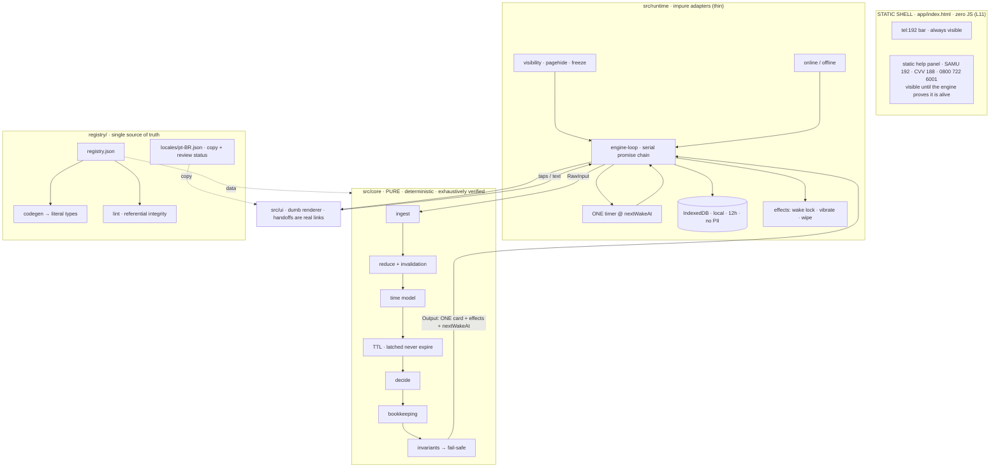
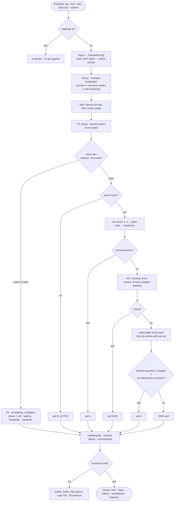
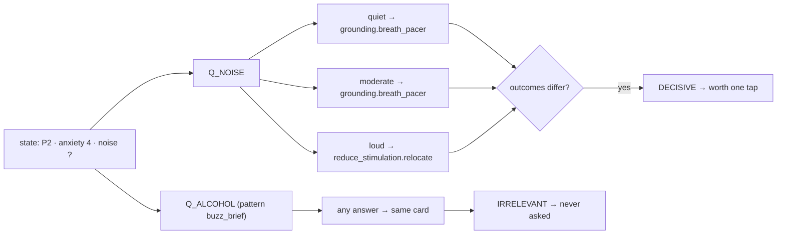
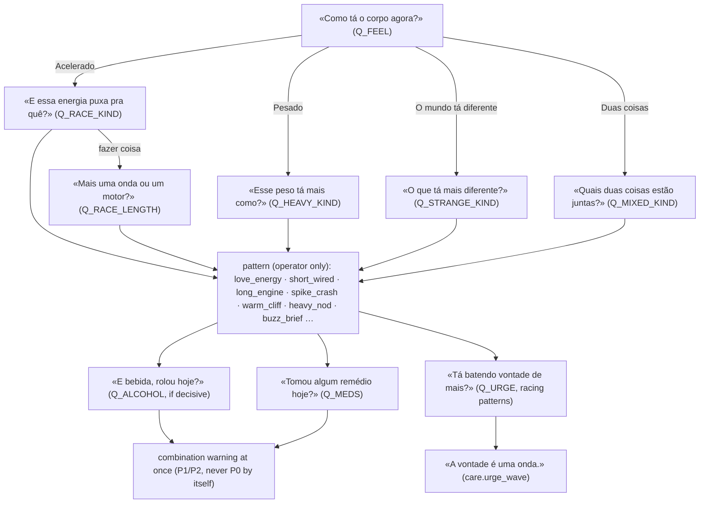
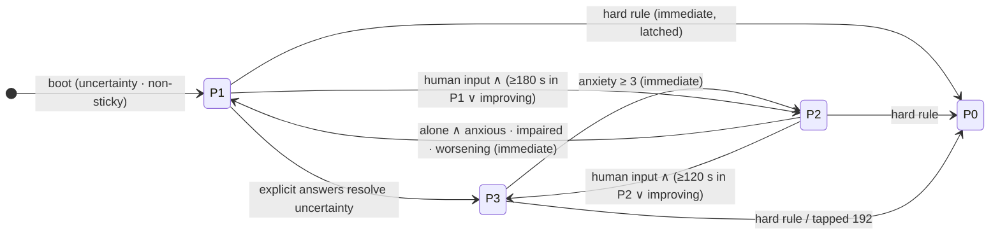
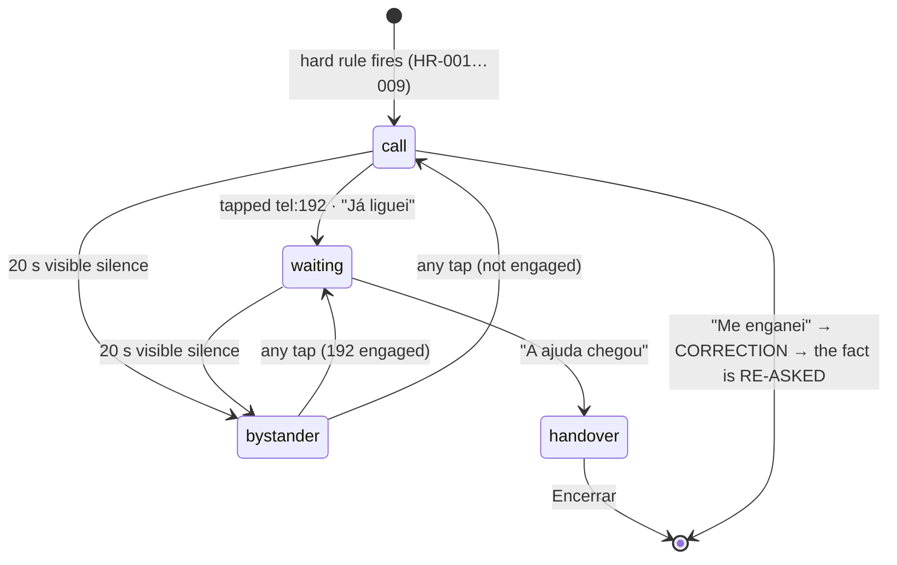
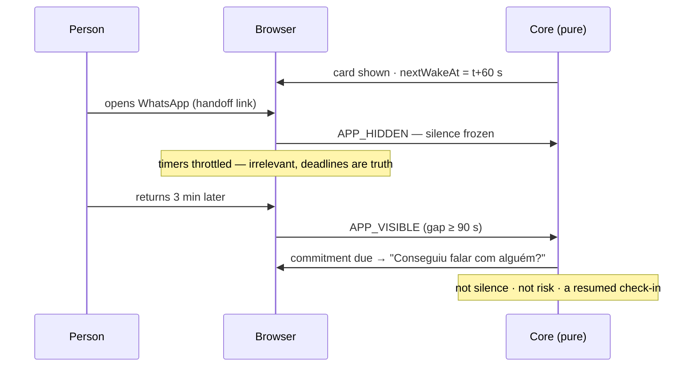

# SOS Apollo · Harm-Control Runtime — Blueprint v0.1

> **The app does not run flows. On every event, it decides the smallest useful next action. It shows one card at a time, and it can explain every decision.**
> Free · no login · offline · no LLM · no server in v1.

This blueprint audits the three brainstorm versions and closes their gaps. It also documents the base that is already built and verified in this repository. Everything below is backed by running code: `npm run verify`.

---

## 0 · Verdict

**Yes, the latest brainstorm is a sound base for an independent engine that feels intelligent. It needed 9 safety-critical and 10 correctness fixes before it could be trusted with a life.** The fixes are applied, and the base is built:

| What | Status | Evidence |
|---|---|---|
| Universal registry (`registry/registry.json`) — single source of truth for 14 signals, 10 questions, 9 hard rules, 8 band rules, 17 policies, 7 skills / 12 strategies, 35 cards, 7 text triggers, 18 invariants | ✔ built | JSON Schema + 11-mutation lint suite |
| Pure deterministic core (`src/core`) — no clock, no I/O, no randomness, no DOM | ✔ built | architecture test scans every file |
| "Akinator" question engine (value of information by counterfactual simulation) | ✔ built | 387,072 states verified with the VOI layer on |
| Exhaustive verification of the decision space | ✔ passing | **3,151,872** states · **11,280,384** monotonicity checks · **510** P0-precedence combos · **46/46** rules reachable |
| Property tests (random event sequences) | ✔ passing | 5 properties × 400 runs per CI run (stress-tested at 4,000) × ≤45 steps |
| Golden scenarios (the brainstorm's own stories) | ✔ passing | 14 executable stories |
| Static emergency shell + PWA + e2e in real Chromium | ✔ passing | 192 works with JS off, after a crash, and 2 taps from boot |
| Whole engine + registry + copy, bundled | ✔ | **80 KB** min · **25 KB** gzip in v0.1 (v0.2 with the continuity plane: 107 KB, see v0.2 §13b) |
| Clinical content | ✖ **draft** | release gate blocks production until a clinician signs (`docs/CLINICAL-REVIEW.md`) |

**On "0 chance of error":** no system can promise that, and claiming it would be the most dangerous line in this document. Here is what the base *does* guarantee, by exhaustive proof rather than sampling:

- Every reachable abstract state gets exactly one valid decision.
- P0 always has exactly one commander, and it never asks a question first.
- More danger never produces a less severe band.
- Time alone never de-escalates.
- Every decision carries its machine-readable reason.

Three things remain outside any proof: clinical correctness of the copy (human review), a person reporting wrongly (mitigated by "Não sei" and "Me enganei"), and the device itself failing (mitigated by the static shell).

---

## 1 · Audit of the brainstorm evolution

### 1.1 How the idea evolved

| | Oldest | Middle | Latest | This blueprint |
|---|---|---|---|---|
| Brain | LLM extracts + composes, rules decide | Deterministic, no LLM | + actor, runtime events, strategy invalidation | + VOI question engine, latch, hysteresis, registry |
| Selection | Utility formula (`0.72 × …`) | Policy tables | 6 skills | 7 skills · 12 strategies · data-only |
| Questions | "Questions compete by utility" | — lost — | only `assess_responsiveness` | **VOI: critical / decisive / irrelevant** |
| Time | TTL | TTL + silence policy | semantic invalidation > TTL | + latched values, deadlines, `nextWakeAt` |
| Identity | `userId`, 4 memories | `userId` | "no identity" (but `userId` remains) | anonymous local `sessionId`, zero PII |
| Bots | — | — | captcha idea | no gate before help; gate only v2 server effects |

### 1.2 Keep: what the brainstorm got right

Event is fact · state is temporary · hard rules first, first match wins · one foreground card + N background effects · `whySkill` structured log · silence ≠ background ≠ offline · emergency outside the loop · `substanceClass` explicit-only · "Não consigo" invalidates the strategy · no open chat in v1.

### 1.3 Critical catches (safety)

| # | Finding | Why it matters | Fix (implemented) |
|---|---|---|---|
| **A1** | "Time beats stale data" also applied to `breathing = severely_abnormal`. After its TTL it would become `unknown` and **P0 would silently turn off.** | The most dangerous line in the brainstorm. | **Latched values** (`expiresAt = null`), a P0 latch in state, and law L03: *time never lowers severity*. Only `CORRECTION` or ending the session leaves P0. Proven by a property test and the `latched-p0-survives-time` scenario. |
| **A2** | A captcha or "human game" before help. | It delays P0 and adds stress, contradicting L05 and L12. | No entry gate. v1 has no abusable endpoint. The breath pacer *is* the human step, but it calms and never gates (ADR-0003). |
| **A3** | Events that claim what a browser cannot know (`BUDDY_SMS_SENT`). | A web page cannot know whether an SMS was sent or a call placed. | `HANDOFF_OPENED` (an observed tap) is separate from `EMERGENCY_CALL_REPORTED` ("Já liguei") and from reported arrival. Law L01. |
| **A4** | "Buddy/welfare escalation on silence." | A browser cannot contact anyone on the user's behalf. That needs a server, pre-consent and anti-abuse. | v1 uses **bystander mode**: the screen turns into a message any passer-by can read, with wake lock and vibration. Automatic escalation is v2, opt-in and gated. |
| **A5** | No path for self-harm, fainting, or "I already called 192". | These are real in this population. | HR-006 fainted and HR-007 self-harm (proposed, need clinical sign-off), HR-009 user-initiated call, and a CVV 188 strategy. |
| **A6** | Double taps, and taps on a card that already changed. | Stale answers corrupt the state. | Card instance ids. A stale tap is rejected, **except a stale tap on 192, which is always honored** (INV-015). |
| **A7** | Bands flapping and dropping by the clock. | Found by the simulator: an anxiety TTL expiry was dropping P2 → P3 with no human input. | Hysteresis. Leaving a sticky band needs an explicit human input. Proven by Tier C. |
| **A8** | Question selection disappeared between versions. | That is exactly the "Akinator" requirement. | The VOI engine (§5). |
| **A9** | Nothing guaranteed that every state has an answer. | A blank screen in a crisis. | An always-eligible `hold` strategy, lint rule INV-018, and an exhaustive totality proof. |

### 1.4 High: correctness and architecture

| # | Finding | Fix |
|---|---|---|
| B1 | `processEvent(userId, …)` contradicts "no login". | `sessionId` is random, local, and wiped after 12 h. |
| B2 | `confidence: 0.98`, `utility = …` is fake precision. The brainstorm said so itself; applied everywhere now. | Discrete `source`, and an ordinal risk vector from 0 to 4. |
| B3 | Leftovers: `allowOpenChat`, `SILENCE_TIMEOUT` emitted by the UI, `CHECK_COMPANION_ARRIVAL` never defined. | The registry and the linter make undefined references impossible. |
| B4 | "Não consigo" needs *strategies inside skills*. | `relocate → in_place → next skill`, fully data-driven. |
| B5 | `setTimeout` treated as truth. | Deadlines, plus one timer at `nextWakeAt`. Proven piecewise-constant. |
| B6 | Re-entrancy: a timer and a tap arriving together. | A pure core behind one serial promise chain. |
| B7 | "não tô com dor no peito" would fire the chest trigger. | Negation window: a negated match **asks**, an affirmative one **acts**. |
| B8 | A question on screen vanished on a timer tick. *Found by a property test.* | The question already shown doesn't consume budget again. |
| B9 | A forced question was lost behind the actor question. *Found by a property test.* | It lives until it has been seen and acted on. |
| B10 | Band rules BR-P1-02 and BR-P2-03 could never fire. *Found by the coverage gate.* | Removed. Dead rules now fail the build. |

### 1.5 Medium: product

- **WhatsApp-first** (Brazil): `https://wa.me/?text=…` opens WhatsApp with a ready-made message and the person picks the contact. SMS and phone calls are the fallbacks. The app never stores a number.
- **iOS PWA:** there is no background execution, and push works only for installed PWAs. Nothing in the design relies on either.
- **Taps to first intervention** is now a KPI. A self user in panic reaches the first action in 5 taps (actor, red flags, clarity, anxiety, company). It is tunable through `engagement.questionBudget` (decision D4).
- **Accessibility:** 52–68 px targets, one card, high contrast, reduced motion, Atkinson Hyperlegible, and `aria-live="assertive"` in P0.

---

## 2 · The twelve laws

These live in `registry.json → laws` and are cited by id in code and tests.

| | Law |
|---|---|
| L01 | **Event is fact.** The app only records what it actually observed: a tap is a tap, not a completed call. |
| L02 | **State is temporary.** Explicit event beats TTL; TTL beats stale data. |
| L03 | **Escalate fast, de-escalate slow.** Time never lowers severity; only explicit events do. |
| L04 | **Hard rules beat everything.** One P0 has one commander: the first matching rule wins. |
| L05 | **P0 does not optimize, it executes.** Nothing is asked before the emergency action. |
| L06 | **Silence raises uncertainty; it never invents a symptom.** Background is not silence. |
| L07 | **One foreground action, N background effects.** The higher the criticality, the smaller the interface. |
| L08 | **Ask only what can change what happens next.** |
| L09 | **"Não consigo" invalidates the strategy, never the person.** |
| L10 | **Actor defines perspective, never identity.** No login, no names, no numbers stored. |
| L11 | **Emergency does not depend on JavaScript staying alive.** The app fails to the shell. |
| L12 | **The real world beats the app.** Nothing (captcha, network, onboarding) ever gates help. |

### 2b · Acolhimento: laws L21–L24 (audit 010)

The owner's field test showed the v0.1 rhythm felt like an interrogation: "how are you now?" after every exercise and after
every minute of silence, and no calming technique at all for a person alone. Four laws now bind the rhythm (registry
`laws`, enforced by lint, runtime and tests; details in `app/_audit/010-acolhimento/`):

| | Law |
|---|---|
| L21 | **Help comes before questions.** After a short triage, at most one question stands between two helps (`questionsBetweenHelps`). |
| L22 | **Never interrupt help to ask how the person is.** Silence on a help card adds "Tô aqui com você. Sem pressa."; a timer never replaces a help card (except P0, a lost contraindication, or a safety re-check while someone is watched). |
| L23 | **A way out and a menu, always.** Every non-P0 card offers techniques, people to reach and "how I am", filtered by the same contraindications and perspective rules. |
| L24 | **No question repeated within its interval** (`minIntervalSec`); "Prefiro só continuar" is always an answer. |

### 2c · Pista: laws L25–L30 (audits 011–014)

| | Law |
|---|---|
| L25 | **Pace is read, never reported.** The time a person takes to answer (derived `pace`) may make the app ask less and offer simpler things first; it never becomes anxiety, never moves a band, never diagnoses. |
| L26 | **What was used only adds care.** Learned the way a friend would, from how the body feels (L30), one question between two helps, never before the first help; a dangerous combination raises the band (P1/P2) and brings its warning at once, never P0 by itself; no dose, no second substance, no antidote (INV-030). ~~Asked directly («O que você usou?», then «Qual deles? Teve álcool junto?»)~~: retired in audit 014. |
| L27 | **Breathing is the background, not a step.** A slow orb (in 4 · hold 1 · out 6) paces the breath behind every non-P0 card while breathing is normal and the person responds; the breathing card is retired. |
| L28 | **Only the person moves the screen** (audit 012). Time (a timer, an answer ageing out, a follow-up falling due) never replaces a card, question or help; it waits for the next tap. Only P0 can. |
| L29 | **No grading.** The app never asks the person to grade how they are (audit 013): no better/worse buttons, no «how are you now?», no timed check-in. What it knows comes from what they choose to tell and tap. |
| L30 | **Discreet discovery, from the same side** (audit 014, studies/004). The app never asks «o que você usou?» and never names a substance to the person (INV-034, linted over every card, chip, notice and summary phrase). It asks how the body feels, then one gentle detail at a time, and follows the care that body needs. The inferred `pattern` is a hypothesis for care, shown only to the lab operator (Pista, Ctrl+H), never a fact (L15, L16). |

Anxiety is asked **once** per session (`Q_ANXIETY maxAsks 1`, answer valid 1 h). The loop alternates a technique and a
care tip (`help.last`), rotating least-shown first, forever: see `app/_audit/011-pista/` and `scripts/converse.ts`.

---

## 3 · Architecture



**Dependency rule (INV-016, tested):** `core` imports nothing from `runtime` or `ui` and never touches `Date.now`, `fetch`, `window`, storage, timers or `Math.random`. Time enters only as `RawInput.at`, which makes every session replayable byte for byte.

---

## 4 · The heartbeat: `processEvent()`



---

## 5 · The Akinator engine (value of information)

Akinator picks the question that best splits its hypotheses. SOS Apollo does the deterministic, safety-first version. For every askable question, it runs **each possible answer through the real decision pipeline** and looks at what would happen next:

| Class | Meaning | Engine does |
|---|---|---|
| **critical** | some answer would put the person in P0 | asks it **before anything else** |
| **decisive** | some answer would change the next action | asks it if the band's budget allows and no intervention is on screen |
| **irrelevant** | no answer changes anything | **never asks** (L08) |



Three behaviours emerge without a line of flow code:

- **Triage order emerges from risk.** For a helper, the first question is "A pessoa responde quando você chama ou toca nela?". It is critical because one answer reveals P0. For a self user, the first question is the red-flag card.
- **Monitoring emerges from TTL.** `breathing = normal` expires after 10 minutes. It becomes `unknown`, which is critical again, so it is re-asked, the way a harm-reduction team re-checks breathing. Since audit 010 (L22) the re-check interrupts a help card on a timer only while someone is being watched (helper, or medical risk); otherwise it comes right after the next tap.
- **Asking stops when it stops mattering.** The budget caps questions in a row, and a question never interrupts an intervention already on screen.

Cost: about 20 pure evaluations per step, around **0.7 ms** on a laptop. Target on low-end Android: under 16 ms.

### 5b · Discreet discovery (audit 014, L30)

The same VOI engine drives a friend-like conversation about the body (studies/004: `akinator-effects-flow.md`,
`suggested_flows.md`). Nothing asks what was used; nothing names a substance. Each question is asked only if some answer
changes the next help (so «E bebida?» is skipped when it cannot change anything), and a help always sits between two
questions (L21).



Golden stories: `pista-energia-bebida-remedio`, `pista-despencou-bebida-helper`, `tontura-com-remedio-de-erecao`.

---

## 6 · Bands and hysteresis



| Band | Meaning | Interface budget |
|---|---|---|
| **P0** | possible immediate emergency: bypass everything | 2 actions + 1 low-emphasis link · ≤200 chars · 0 questions |
| **P1** | safety or company must be stabilized | 3 actions · 3 answers + "Não sei" · ≤220 chars · 2 questions in a row |
| **P2** | significant distress, still interactive | 3 actions · 4 answers · ≤260 chars · 3 questions |
| **P3** | stable | 3 actions · 4 answers · ≤320 chars · education allowed |

Risk is ordinal, and each dimension takes the **maximum** of its matching rows. There are no weights. `medical · impairment · isolation · emotional · environmental · uncertainty`.

---

## 7 · P0 lifecycle



The copy is reason × actor specific (`breathing.helper`, `seizure`, `chest.self`, …). Every P0 card also carries the non-blocking aside: *"Se der, deixe à mão: o que foi usado, quanto e quando."* That is information for the SAMU call, and it never delays the call (L05).

---

## 8 · Time model: three kinds of "nothing happened"



| | Condition | Effect |
|---|---|---|
| **SILENCE** | card visible for the whole window with no human input | uncertainty rises and a help card shows "Tô aqui com você. Sem pressa." (L22: never a question). Only with a known medical risk (HR-008) can it lead to P0 bystander mode. |
| **APP_UNAVAILABLE** | hidden, frozen or closed | nothing accrues. On return, `resumedAfterGap` triggers a check-in. |
| **CONNECTIVITY_LOST** | offline | only strategies that need network are affected (WhatsApp → SMS). |

---

## 9 · The universal registry: how chaos is prevented

```
registry/
├── registry.json          ← THE source of truth (canonical formatting, reviewable diffs)
├── registry.schema.json   ← shape (editor autocomplete, CI validation)
└── locales/pt-BR.json     ← every visible word + review status per card
```

| Section | Holds | Section | Holds |
|---|---|---|---|
| `laws` | L01–L12 | `bandRules` | first match → P1/P2/P3 (sticky or not) |
| `regions.BR.numbers` | 192 · 188 · 0800 722 6001 · 190 · 193 | `hysteresis` · `engagement` · `silence` | per-band budgets |
| `signals` | domain · TTL · latched · explicitOnly | `requirements` | movement · safe_location · network |
| `facts` | non-signal paths predicates may read | `commitments` | FRIEND_ARRIVAL · RELOCATION · CONTACT_REPLY · CHECK_IN |
| `invalidation` | semantic replacement rules | `skills` | 7 skills, 12 strategies |
| `events` | the domain event catalog | `policies` | P1/P2/P3 tables |
| `questions` | per-actor variants, answers → signal sets | `cards` · `chips` | actions → ops, handoffs |
| `textTriggers` | normalized regex + negation | `invariants` | INV-001…018 + how each is enforced |
| `hardRules` | HR-001…009, latch, onCorrection | `storage` · `shield` | privacy + bot posture |

**Change workflow:** edit JSON → `npm run registry:format` → `npm run registry:codegen` (IDs become TypeScript literal types) → `npm run registry:lint` → `npm test`. Four guards stand between a typo and production:

1. **Codegen.** A skill declared in JSON but not implemented, or implemented but not declared, fails to *compile*. The map is `{ [K in SkillId]: Skill }`.
2. **Lint.** Every predicate path exists, every literal is inside its domain, `gte` is only used on numbers. Every card fits its band's budget, every policy table ends in an always-eligible rule, and every answer has a label. Text triggers can never set `substanceClass`. Clinical copy must be reviewed in `--release` mode.
3. **Exhaustive coverage.** A rule that can never fire fails the build.
4. **Schema.** Shape errors fail in the editor and in CI.

**ID conventions:** `HR-###` · `BR-P#-##` · `P#-###` (gaps of 5–10) · `Q_UPPER` · `CARD_UPPER` · `lower_snake` skills · `TT-###` · `INV-###` · `L##`. IDs are append-only and never reused.

---

## 10 · Skills catalog (9 skills, 45 strategies; 1 retired)

| Skill | Bands | Strategies (in order) | Notes |
|---|---|---|---|
| `assess` | P1–P3 | *(VOI-driven)* | the only assessment skill. Replaces `assess_responsiveness`. |
| `emergency_escalation` | P0 | phases: call → waiting → bystander → handover | derived from state, never chosen by policy |
| `reduce_stimulation` | P1–P2 | `relocate` (needs movement + safe location) → `in_place` | "Não consigo" blocks `relocate` for 30 min |
| `contact_trusted_person` | P1–P2 | `stay_close` → `message_whatsapp` (network) → `message_sms` → `crisis_line` (CVV 188, self only) | "Não tenho ninguém" blocks both message strategies |
| `confirm_commitment` | P1–P3 | per commitment kind | generalizes `confirm_arrival` |
| `grounding` | P1–P3 | `cold_water` → `feet_floor` → `double_sigh` → `five_senses` → `humming` → `press_wall`, **rotating** least-shown first (`breath_pacer` retired: the orb, L27) | breathing exercises and cold water need normal breathing + responsive (INV-027); `five_senses` deferred while pace = slow (L25) |
| `combination` | P1–P3 | `rush_then_sleep` · `downers` · `poppers_pill` · `coke_alcohol` · `md_alcohol` · `stim_alcohol` · `stim_sex` · `wired_unplugged` | audits 011/014: the warning for what was mixed, the moment it is described (by effects, never by name); never alternates, never P0 by itself |
| `care` | P1–P3 | what the person reported first (`cool_body`, `inhalant_air`, `nose_rinse`, `throat_soothe`, `nausea_care`, `jaw_ease`), then safety notes (`pill_care`, `urge_wave`; ~~`poppers_care`~~ retired in 014), then the body feel (`side_safe`, `ride_wave`, `put_away`), then everyday care (`sip_water`, `fresh_air`, `eat_something`, `brush_teeth`, `cool_shower`, `soft_music`), rotating | nothing by mouth unless `can_swallow`; shower only when `awake`; copy per pattern, then class (`drug` variant: `pattern.actor` → `pattern` → class) |
| `steady_check` | P1–P3 | `tips` (P3, by substance class) → `check_later` (P3) → **`hold`** (always eligible) | **new**: without it P3 had no skill and totality could not be proven |

**Why 7 and not 6:** the latest brainstorm fixed 6 skills. The audit found no skill for P3 and no guaranteed fallback anywhere, which leaves a blank screen as a possible outcome. `steady_check.hold` closes that hole and makes totality provable. Decision D10 asks you to approve it.

---

## 11 · Policy tables (as shipped)

| P1 | when | skill | | P2 | when | skill |
|---|---|---|---|---|---|---|
| P1-005 | commitment due | confirm_commitment | | P2-005 | commitment due | confirm_commitment |
| P1-010 | resumed (not silence, L22) | assess · Q_HOW_NOW | | P2-010 | resumed (not silence, L22) | assess · Q_HOW_NOW |
| P1-012 | mixing ≥ 2 | combination (L26) | | P2-012 | mixing ≥ 2 | combination (L26) |
| P1-015 | self ∧ no grounding done yet | grounding (L21) | | | | |
| P1-020 | alone ∧ ¬friend coming ∧ ¬contact pending | contact_trusted_person | | P2-020 | loud ∧ emotional ≥3 | reduce_stimulation |
| P1-030 | loud | reduce_stimulation | | P2-035 | a help shown ∧ last help ≠ care | care |
| P1-032 | helper ∧ a help shown | contact_trusted_person (stay close) | | P2-040 | emotional ≥3 | grounding |
| P1-035 | a help shown ∧ last help ≠ care | care | | P2-050 | loud | reduce_stimulation |
| P1-040 | emotional ≥3 | grounding | | P2-060 | always | grounding |
| P1-045 | last help ≠ grounding | grounding | | | | |
| P1-050 | always | contact_trusted_person | | | | |
| P1-099 | always | steady_check (hold) | | P2-099 | always | steady_check (hold) |

P3: `P3-005` commitment due → confirm · `P3-010` resumed → Q_HOW_NOW · `P3-050` a help shown ∧ last ≠ care → care · `P3-060` a help shown ∧ last ≠ grounding → grounding · `P3-099` always → steady_check.

**Hard rules (precedence = order):** HR-001 unresponsive · HR-002 severe breathing · HR-003 seizure · HR-004 chest · HR-005 physically unsafe · HR-006 fainted *(proposed)* · HR-007 self-harm *(proposed)* · HR-008 medical risk + 2 visible silences *(proposed, not latched)* · HR-009 user tapped 192.

---

## 12 · Invariants and how each is enforced

| INV | Statement | Enforced by |
|---|---|---|
| 001 | P0 ⇒ `emergency_escalation` | runtime · exhaustive (3.5 M states) |
| 002 | exactly one foreground card | types · runtime |
| 003 | tel:192 on every screen, outside the loop | static HTML · e2e (JS off, crash) |
| 004 | arrived ⇒ not alone | runtime · property · reachability |
| 005 | blocked strategy never selected | runtime · exhaustive |
| 006 | unsafe or impaired ⇒ no movement strategy | requirements · exhaustive |
| 007 | latched values never expire; P0 leaves only by CORRECTION | property · scenario |
| 008 | budgets (actions, answers, chars) per band | lint · runtime |
| 009 | question maxAsks + cooldown after "Não sei" | runtime · property |
| 010 | `decide()` is total | exhaustive · lint INV-018 |
| 011 | deterministic | property (byte-identical replays) |
| 012 | `substanceClass` only from an explicit answer | reducer · lint |
| 013 | silence only while visible | scenario · property |
| 014 | education only where allowed | lint |
| 015 | stale tap rejected, except tel:192 | ingest · scenario · property |
| 016 | core is pure | architecture test · CSP |
| 017 | P0 never asks first | exhaustive |
| 018 | every policy table ends always-eligible | lint |

**Plus two properties the brainstorm never named, now proven:**

- **Monotonicity.** Stepping any single factor toward danger (anxiety, responsiveness, breathing, company, trend, silence, noise) never lowers the band. That is 11.3 M checks.
- **Piecewise-constant time.** Between `nextWakeAt` boundaries the decision cannot change without input, so a single timer is provably enough.

---

## 13 · Verification pyramid ("toward zero error")

```
                    ┌───────────────────────────┐
                    │ e2e · real Chromium (7)   │  192 with JS off · after crash · 2 taps to P0
                ┌───┴───────────────────────────┴───┐
                │ golden scenarios (14 stories)     │  the brainstorm, executable
            ┌───┴───────────────────────────────────┴───┐
            │ property tests · 5 × 400 runs (stress 4k)  │  invariants · determinism · latch · time
        ┌───┴───────────────────────────────────────────┴───┐
        │ exhaustive · 3.15 M + 387 k + 2.3 k + 510 states    │  totality · safety · monotonicity · coverage
    ┌───┴───────────────────────────────────────────────────┴───┐
    │ registry lint (+11 mutation tests) · schema · codegen · tsc strict │
    └────────────────────────────────────────────────────────────┘
```

The pyramid has already paid for itself. It caught **5 real defects** before this document was written: B8, B9, B10 (×2) and A7.

---

## 14 · Security, bots and the captcha question

| Surface | v1 posture |
|---|---|
| Entry | **no gate.** A bot loading a static page gains nothing. |
| Handoffs | native `tel:`, `sms:` and `wa.me` links, run by the user's phone inside their own gesture. No server, no SMS bill, no pumping target. |
| Code integrity | strict CSP (`default-src 'self'`, no third-party scripts), content-hashed bundle served immutable, SRI on the module tag, SW VERSION stamped from the shell's content (`scripts/build.ts`; true since 2026-09-25, before that the bundle was unhashed and the SW VERSION constant). |
| Exfiltration | no analytics, no telemetry, no endpoint on self to post to. |
| DDoS | static CDN (Cloudflare Pages or Netlify) absorbs volumetric attacks. |
| "Human steps" | the breath pacer: a calming micro-interaction, **never a gate**. |
| **v2 only** | relay SMS to a pre-consented contact, or a welfare ping on silence. Gated by invisible Turnstile + proof-of-work + rate limits + a country allowlist, **never in P0/P1**. |

---

## 15 · Privacy and LGPD

Health data is **sensitive personal data** under the LGPD, and drug-use context can also be self-incriminating. So the design stores as little as possible:

- **Nothing identifies the person.** No login, name, phone number, location or free text (text is matched and discarded; only the trigger id is logged).
- **Everything stays on the device.** Local IndexedDB only, retained for 12 hours, with a one-tap "Apagar agora".
- **Nothing is analyzed or shared.** `substanceClass` is operational context only: never inferred, never exported, never used for analytics.
- **Every decision is auditable locally.** Each log entry carries `registry` hash + `engine` version, so a decision can be explained on the device without sending anything anywhere.

---

## 16 · Folder skeleton

```
sos-apollo/
├── registry/
│   ├── registry.json              single source of truth (1.6 k lines, canonical format)
│   ├── registry.schema.json       JSON Schema 2020-12
│   └── locales/pt-BR.json         all UI copy · review status per card
├── src/
│   ├── generated/registry.gen.ts  ← codegen: literal unions for every ID (never edit)
│   ├── core/                      PURE · deterministic · no I/O
│   │   ├── registry/{index,types}.ts      load once, index, inject as `Reg`
│   │   ├── domain/{signals,events,state,decision}.ts
│   │   ├── logic/{predicate,facts}.ts     DSL evaluator (+trace) · fact projection + catalog
│   │   ├── ingest/{ingest,text-triggers,normalize-text}.ts
│   │   ├── state/{reducer,signals-apply,expiration,commitments,time,invariants}.ts
│   │   ├── safety/{hard-rules,risk-vector,band-engine}.ts
│   │   ├── planner/{decide,voi,eligibility}.ts
│   │   ├── skills/{index,skill,strategy-skill,variants}.ts
│   │   │   ├── assessment/assess.ts
│   │   │   └── intervention/{emergency-escalation,reduce-stimulation,contact-trusted-person,
│   │   │                     confirm-commitment,grounding,steady-check}.ts
│   │   └── process-event.ts       the heartbeat (startSession · processEvent)
│   ├── runtime/                   impure shell (thin)
│   │   ├── boot.ts · engine-loop.ts · deadline-scheduler.ts · signals-browser.ts
│   │   ├── effects.ts · clock.ts
│   │   └── storage/session-store.ts
│   ├── ui/{render,locale,breath-pacer}.ts   dumb renderer · copy resolution · the human step
│   └── demo/demo.ts               engineering simulator (virtual clock + brain panel)
├── ../index.html (= /app/)        static shell · app.css · sw.js · manifest · assets/ (stamped in place; /_headers at the repo root)
├── tests/
│   ├── exhaustive/decision-space.test.ts   Tier A/B/C · precedence · coverage
│   ├── property/engine.property.test.ts    fast-check random sequences
│   ├── scenarios/{scenarios,scenarios.test}.ts   18 golden stories
│   ├── registry/{lint,schema}.test.ts      + 11 mutation cases
│   ├── invariants/text-triggers.test.ts
│   ├── architecture/boundaries.test.ts     INV-016
│   └── e2e/shell.e2e.ts                    real Chromium
├── scripts/  registry-{codegen,lint,format}.ts · simulate.ts · build-demo.ts · bench.ts
└── docs/     BLUEPRINT.md · CLINICAL-REVIEW.md · adr/0001…0005
```

---

## 17 · A real session (output of `npm run simulate`)

```
t+  0s boot            │ P1 assess      [BR-P1-03 → PREREQUISITE]   «Quem precisa de ajuda?»
t+  2s answer self     │ P1 assess      [VOI_CRITICAL]              «Agora, algum destes?»
t+  4s answer none     │ P3 assess      [VOI_DECISIVE]              «Você consegue pensar e responder normalmente?»
t+  6s answer yes      │ P3 assess      [VOI_DECISIVE]              «Quanto de ansiedade agora?»
t+  8s answer high     │ P2 assess      [VOI_DECISIVE]              «Tem alguém de confiança aí com você?»
t+ 10s answer alone    │ P1 contact_trusted_person.message_whatsapp [BR-P1-04 → P1-020]
t+ 12s open_whatsapp   │ P1 assess      [VOI_DECISIVE]              «Como está o lugar agora?»
t+ 13s APP_HIDDEN      │ (silence frozen)
t+198s APP_VISIBLE     │ P1 confirm_commitment.contact_reply        «Conseguiu falar com alguém?»
t+200s someone_coming  │ P2 …  + chip «Chegou alguém? Toque aqui»    FRIEND_ARRIVAL due in 10 min
t+440s chip arrived    │ P3 …  company := with_someone (INVAL-001, immediate — no TTL wait)
```

---

## 18 · Decisions that need your approval

| # | Decision | Recommendation |
|---|---|---|
| D1 | HR-005 "physically unsafe" → P0 with 192 as the hero and 190 mentioned in the copy | approve, with clinical and ops review of the 190 wording |
| D2 | HR-006 fainted, HR-007 self-harm (192 + CVV 188), HR-008 silence after medical risk | approve as *proposed* and send to a clinician |
| D3 | Self users get the red-flag card before "Você consegue responder normalmente?" (a question that can reveal P0 goes first) | approve |
| D4 | Question budgets: taps to first intervention = 5 for self in panic. Lower P2 from 3 to 2? | field-test with the simulator |
| D5 | Retention 12 h + "Apagar agora" | approve |
| D6 | BR-P1-05: downer + alone → P1 | clinical sign-off |
| D7 | Hysteresis dwell 180 s (P1) / 120 s (P2) | approve, tune in the field |
| D8 | Hosting: Cloudflare Pages vs Netlify (both connectors are available in this workspace) | Cloudflare Pages (edge headers + Turnstile ready for v2) |
| D9 | Clinical reviewer (name, registration) | required before any public URL |
| D10 | 7 skills (adds `steady_check`) instead of 6 | approve: totality depends on it |

---

## 19 · Roadmap

| Milestone | Scope | Exit criterion |
|---|---|---|
| **M0 · done** | registry, pure core, VOI, proofs, shell, simulator | `npm run verify` green |
| **M1 · 2–3 wks** | UI polish, installable PWA, a11y audit (WCAG 2.2 AA), clinical copy review | `registry:lint --release` green |
| **M2 · 4–6 wks** | field pilot with a harm-reduction team; opt-in, on-device log export; budget tuning | taps-to-first-action and time-to-192 measured |
| **M3** | v2 server effects (pre-consented relay, welfare ping) behind Turnstile + PoW + rate limits | abuse tests + LGPD DPIA |
| **M4** | EN/ES locales, more regions, more skills (each one: data + scenario + review) | coverage gate still 100 % |

---

## Sources

- SAMU 192 — Ministério da Saúde: https://www.gov.br/saude/pt-br/composicao/saes/samu-192
- CVV 188 — https://cvv.org.br/ligue-188/
- Disque-Intoxicação 0800 722 6001 — Anvisa: https://www.gov.br/anvisa/pt-br/assuntos/agrotoxicos/disque-intoxicacao
- Page Visibility API — MDN: https://developer.mozilla.org/en-US/docs/Web/API/Page_Visibility_API
- URI schemes (`tel:`) — MDN: https://developer.mozilla.org/en-US/docs/Web/URI/Reference/Schemes
- Cloudflare Turnstile — https://developers.cloudflare.com/turnstile/
- SMS pumping fraud — Twilio: https://www.twilio.com/en-us/blog/sms-pumping-fraud-solutions
- LGPD sensitive data — ANPD FAQ: https://www.gov.br/anpd/pt-br/acesso-a-informacao/perguntas-frequentes
- WHO guidance on large multi-modal models in health: https://www.who.int/publications/i/item/9789240084759
